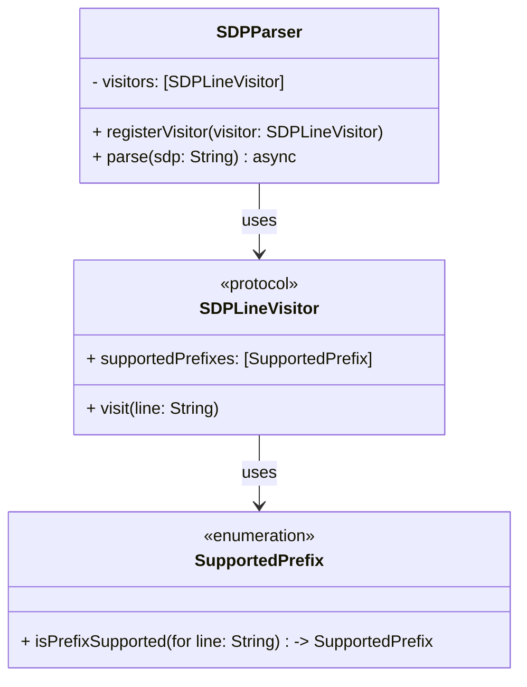

# SDP Parser

This repository contains an implementation of an SDP (Session Description Protocol) parser. The parser is designed using the Visitor pattern to process different types of SDP lines efficiently.

## Architecture

### Overview

The SDP parser is built around the Visitor pattern, which allows for flexible and extensible processing of different SDP line types. The main components of the architecture are:

- **SDPParser**: The main parser class that processes the SDP string and delegates line processing to registered visitors.
- **SDPLineVisitor**: A protocol that defines the interface for visitors that process specific SDP line prefixes.
- **SupportedPrefix**: An enumeration that defines the supported SDP line prefixes.

### Visitor Pattern

The Visitor pattern is used to separate the algorithm for processing SDP lines from the objects on which it operates. This allows for adding new processing logic without modifying the existing parser code.

#### Components

- **SDPParser**: The main parser that holds a list of visitors and delegates line processing to them.
- **SDPLineVisitor**: A protocol that visitors must conform to. Each visitor handles specific SDP line prefixes.
- **SupportedPrefix**: An enumeration that defines the supported prefixes and provides a method to check if a line has a supported prefix.

#### Class Diagram



#### Data Flow

- **SDP String Input**: The SDP string is provided to the SDPParser's parse method.
- **Line Splitting**: The SDP string is split into individual lines.
- **Prefix Checking**: Each line is checked to see if it has a supported prefix using the SupportedPrefix enumeration.
- **Visitor Delegation**: If a line has a supported prefix, the parser delegates the line processing to the registered visitors that support the prefix.
- **Line Processing**: Each visitor processes the line according to its specific logic.

##### Sequence Diagram

```
sequenceDiagram
    participant Client
    participant SDPParser
    participant SupportedPrefix
    participant SDPLineVisitor

    Client->>SDPParser: parse(sdp: String)
    SDPParser->>SDPParser: split(sdp, "\r\n")
    loop for each line
        SDPParser->>SupportedPrefix: isPrefixSupported(for: line)
        alt supported prefix
            SDPParser->>SDPLineVisitor: visit(line: String)
        end
    end
```

##### Performance Considerations

The SDP parser is designed to be efficient and scalable. Key performance considerations include:

- **Asynchronous Parsing**: The parse method is asynchronous, allowing for non-blocking parsing of large SDP strings.
- **Visitor Pattern**: The use of the Visitor pattern allows for efficient delegation of line processing, reducing the complexity of the parser.
- **Prefix Checking**: The SupportedPrefix enumeration provides a fast way to check if a line has a supported prefix, minimizing the overhead of line processing.

#### Example Usage

```swift
let parser = SDPParser()
let visitor = MySDPLineVisitor()
parser.registerVisitor(visitor)

let sdpString = """
v=0
o=- 46117317 2 IN IP4 127.0.0.1
s=-
c=IN IP4 127.0.0.1
t=0 0
a=rtpmap:96 opus/48000/2
"""

Task {
    await parser.parse(sdp: sdpString)
}
```

In this example, MySDPLineVisitor is a custom visitor that conforms to the SDPLineVisitor protocol and processes lines with specific prefixes.

#### Conclusion
The SDP parser is a flexible and efficient solution for processing SDP strings. The use of the Visitor pattern allows for easy extension and maintenance, while the asynchronous parsing ensures that the parser can handle large SDP strings without blocking the main thread.