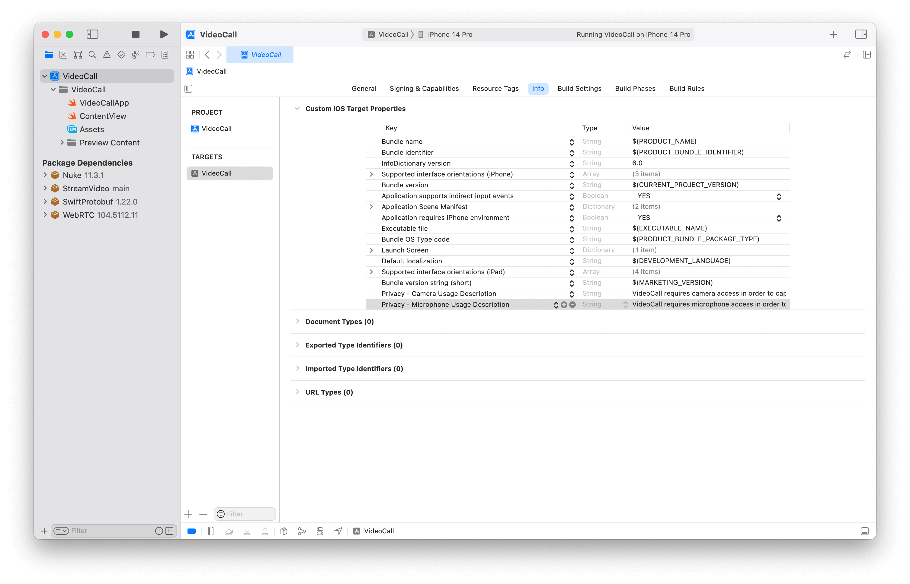
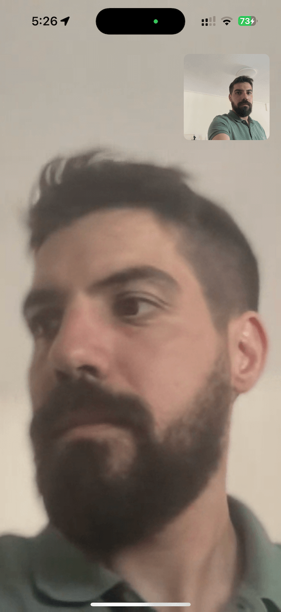
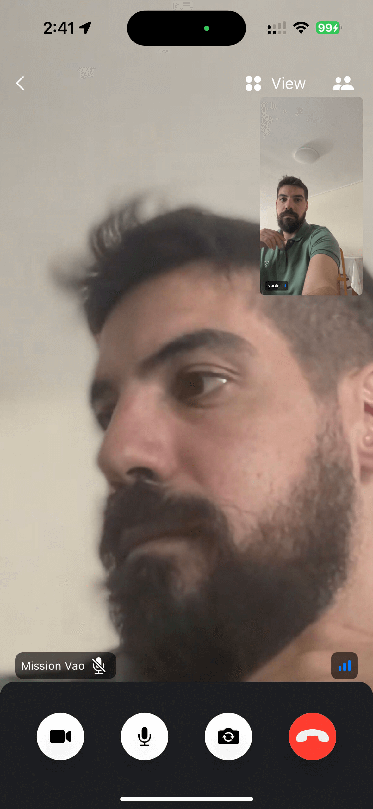

import { TokenSnippet } from '../../../shared/_tokenSnippet.jsx';

This tutorial teaches you how to build Zoom/Whatsapp style video calling for your app.

- Calls run on Stream's global edge network for optimal latency & reliability.
- Permissions give you fine grained control over who can do what.
- Video quality and codecs are automatically optimized.
- Powered by Stream's [Video Calling API](https://getstream.io/video/).

### Step 1 - Create a new SwiftUI Application in Xcode

1. Make sure you have Xcode installed and that you are running 14.3 or later
2. Open Xcode and select "Create a new Project"
3. Select "iOS" as the platform and "App" as the type of Application
4. Name your project "VideoCall" and select "SwiftUI" as the interface

### Step 2 - Install the SDK & Setup permissions

Next you need to add our SDK dependencies to your project using Swift Package Manager from Xcode.

1. Click on "Add packages..." from the File menu
2. Add https://github.com/GetStream/stream-video-swift in the search bar
3. Select "StreamVideo" and "StreamVideoSwiftUI" and then click Add Package

#### App Permissions

Making a video call requires the usage of the camera and the microphone of the device. Therefore, you need to request permissions to use them in your app. In order to do this, you will need to add the following keys and values in your `Info.plist` file.

- `Privacy - Camera Usage Description` - "VideoCall requires camera access in order to capture and transmit video"
- `Privacy - Microphone Usage Description` - "VideoCall requires microphone access in order to capture and transmit audio"



### Step 3 - Create & Join a call

Open up `VideoCall/VideoCallApp.swift` and replace it with this code:

```swift title="VideoCall/VideoCallApp.swift"
import SwiftUI
import StreamVideo
import StreamVideoSwiftUI

@main
struct VideoCallApp: App {
    @State var call: Call
    @ObservedObject var state: CallState
    @State var callCreated: Bool = false

    private var client: StreamVideo
    private let apiKey: String = "" // The API key can be found in the Credentials section
    private let userId: String = "REPLACE_WITH_USER_ID" // The User Id can be found in the Credentials section
    private let token: String = "REPLACE_WITH_TOKEN" // The Token can be found in the Credentials section
    private let callId: String = "REPLACE_WITH_CALL_ID" // The CallId can be found in the Credentials section

    init() {
        let user = User(
            id: userId,
            name: "Martin", // name and imageURL are used in the UI
            imageURL: .init(string: "https://getstream.io/static/2796a305dd07651fcceb4721a94f4505/a3911/martin-mitrevski.webp")
        )

        // Initialize Stream Video client
        self.client = StreamVideo(
            apiKey: apiKey,
            user: user,
            token: .init(stringLiteral: token)
        )

        // Initialize the call object
        let call = client.call(callType: "default", callId: callId)

        self.call = call
        self.state = call.state
    }

    var body: some Scene {
        WindowGroup {
            VStack {
                if callCreated {
                    Text("Call \(call.callId) has \(call.state.participants.count) participants")
                        .font(.system(size: 30))
                        .foregroundColor(.blue)
                } else {
                    Text("loading...")
                }
            }.onAppear {
                Task {
                    guard !callCreated else { return }
                    try await call.join(create: true)
                    callCreated = true
                }
            }
        }
    }
}
```

To actually run this sample we need a valid user token. The user token is typically generated by your server side API.
When a user logs in to your app you return the user token that gives them access to the call.
To make this tutorial easier to follow we'll generate a user token for you:

Please update **REPLACE_WITH_USER_ID**, **REPLACE_WITH_TOKEN** and **REPLACE_WITH_CALL_ID** with the actual values shown below:

<TokenSnippet sampleApp='meeting' />

Now when you run the sample app it will connect successfully. The text will say "Call ... has 1 participant" (yourself). Let's review what we did in the above code.

**Create a user**. First we create a user object. You typically sync these users via a server side integration from your own backend. Alternatively, you can also use guest or anonymous users.

```swift
let user = User(
    id: userId,
    name: "Martin"
)
```

**Initialize the Stream Client**. Next we initialize the client by passing the API Key, user and user token.

```swift
self.client = StreamVideo(
    apiKey: apiKey,
    user: user,
    token: .init(stringLiteral: token)
)
```

**Create and join call** After the user and client are created, we create a call like this:

```swift
self.call = client.call(callType: "default", callId: callId)

try await call.join(create: true)
```

As soon as you use call.join the connection for video & audio is setup.

Lastly, the UI is rendered by observing call.state (participants and connection states):

```swift
call.state.participantCount
call.state.reconnectionStatus
```

You'll find all relevant state for the call in `call.state` and `call.state.participants`. The documentation on [Call state and Participant state](../../guides/call-and-participant-state) explains this in further detail.

### Step 4 - Joining from the web

To make this a little more interactive, let's join the call from your browser.

<TokenSnippet sampleApp='meeting' displayStyle='join' />

On your iOS device, you'll see the text update to 2 participants. Let's keep the browser tab open as you go through the tutorial.

### Step 5 - Rendering Video

In this next step we're going to render your local & remote participant video.

Let's update the body of our VideoCallApp View with following code.

```swift title=VideoCall/VideoCallApp.swift
var body: some Scene {
    WindowGroup {
        VStack {
            if callCreated {
                ZStack {
                    ParticipantsView(participants: call.state.remoteParticipants, onChangeTrackVisibility: changeTrackVisibility(_:isVisible:))
                    FloatingParticipantView(participant: call.state.me)
                }
            } else {
                Text("loading...")
            }
        }.onAppear {
            Task {
                guard callCreated == false else { return }
                try await call.join(create: true)
                callCreated = true
            }
        }
    }
}

/// Changes the track visibility for a participant (not visible if they go off-screen).
/// - Parameters:
///  - participant: the participant whose track visibility would be changed.
///  - isVisible: whether the track should be visible.
private func changeTrackVisibility(_ participant: CallParticipant?, isVisible: Bool) {
    guard let participant else { return }
    Task {
        await call.changeTrackVisibility(for: participant, isVisible: isVisible)
    }
}
```

We will now create

```swift title=VideoCall/ParticipantsView.swift
struct ParticipantsView: View {

    var participants: [CallParticipant]
    var onChangeTrackVisibility: (CallParticipant?, Bool) -> Void

    var body: some View {
        GeometryReader { proxy in
            if !participants.isEmpty {
                ScrollView {
                    LazyVStack {
                        if participants.count == 1, let participant = participants.first {
                            makeCallParticipantView(participant, size: proxy.size)
                                .frame(width: proxy.size.width, height: proxy.size.height)
                        } else {
                            ForEach(participants) { participant in
                                makeCallParticipantView(participant, size: proxy.size)
                                    .frame(width: proxy.size.width, height: proxy.size.height / 2)
                            }
                        }
                    }
                }
            } else {
                Color.black
            }
        }
        .edgesIgnoringSafeArea(.all)
    }

    @ViewBuilder
    private func makeCallParticipantView(_ participant: CallParticipant, size: CGSize) -> some View {
        VideoCallParticipantView(
            participant: participant,
            availableSize: size,
            contentMode: .scaleAspectFit,
            customData: [:],
            onViewUpdate: { participant, videoRenderer in
                videoRenderer.handleViewRendering(for: participant, onTrackSizeUpdate: { _, _ in })
            }
        )
        .onAppear { onChangeTrackVisibility(participant, true) }
        .onDisappear{ onChangeTrackVisibility(participant, false) }
    }
}
```

```swift title=VideoCall/FloatingParticipantView.swift
struct FloatingParticipantView: View {

    var participant: CallParticipant?
    var size: CGSize = .init(width: 120, height: 120)

    var body: some View {
        if let participant = participant {
            VStack {
                HStack {
                    Spacer()

                    VideoRendererView(id: participant.id, size: size) { videoRenderer in
                        videoRenderer.handleViewRendering(for: participant, onTrackSizeUpdate: { _, _ in })
                    }
                    .frame(width: size.width, height: size.height)
                    .clipShape(RoundedRectangle(cornerRadius: 8))
                }
                Spacer()
            }
            .padding()
        }
    }
}

```

Now when you run the app, you'll see your local video in a floating video element and the video from your browser. The end result should look somewhat like this:



Let's review the changes we made.

We added the `changeTrackVisibility` in our app and we propagate its call to the other subviews we create. When this method is being called we are asking the Call object to make the participant's track visible or not visible. This is important when the view goes off-screen (e.g. while scrolling through participants during a call) to reduce energy and data consumption.

```swift
VideoCallParticipantView(
    participant: participant,
    availableSize: size,
    contentMode: .scaleAspectFit,
    customData: [:],
    onViewUpdate: { participant, videoRenderer in
        videoRenderer.handleViewRendering(for: participant, onTrackSizeUpdate: { _, _ in })
    }
)
.onAppear { onChangeTrackVisibility(participant, true) }
.onDisappear{ onChangeTrackVisibility(participant, false) }
```

It only displays the video and doesn't add any other UI elements. The video is lazily loaded, and only requested from the video infrastructure if you're actually displaying it. So if you have a video call with 200 participants, and you show only 10 of them, you'll only receive video for 10 participants. This is how software like Zoom and Google Meet make large calls work.


```swift
FloatingParticipantView(participant: call.state.me)
```

`FloatingParticipantVideo` renders a display of your own video. It uses `VideoRendererView` which is the componet used by `VideoCallParticipantView` to simply display the video without adding any other UI elements.

`ParticipantsView` renders a scrollview of all remoteParticipants.

```swift
ParticipantsView(participants: call.state.remoteParticipants, onChangeTrackVisibility: changeTrackVisibility(_:isVisible:))
```

### Step 6 - A Full Video Calling UI

The above example showed how to use the call state object and SwiftUI to build a basic video UI. For a production version of calling you'd want a few more UI elements:

- Indicators of when someone is speaking
- Quality of their network
- Layout support for >2 participants
- Labels for the participant names
- Call header and controls

Stream ships with several SwiftUI components to make this easy. You can customize the components with theming, arguments and swapping parts of them. This is convenient if you want to quickly build a production ready calling experience for you app. (and if you need more flexibility, many customers use the above low level approach to build a UI from scratch)

To render a full calling UI, we'll leverage the [CallContainer](../../ui-components/call/call-container) component. This includes sensible defaults for a call header, video grid, call controls, picture-in-picture, and everything that you need to build a video call screen.

Let's update the code in our VideoCall/VideoCallApp.swift

```swift title=VideoCall/VideoCallApp.swift
import SwiftUI
import StreamVideo
import StreamVideoSwiftUI

@main
struct VideoCallApp: App {
    @ObservedObject var viewModel: CallViewModel

    private var client: StreamVideo
    private let apiKey: String = "" // The API key can be found in the Credentials section
    private let userId: String = "" // The User Id can be found in the Credentials section
    private let token: String = "" // The Token can be found in the Credentials section
    private let callId: String = "" // The CallId can be found in the Credentials section

    init() {
        let user = User(
            id: userId,
            name: "Martin", // name and imageURL are used in the UI
            imageURL: .init(string: "https://getstream.io/static/2796a305dd07651fcceb4721a94f4505/a3911/martin-mitrevski.webp")
        )

        // Initialize Stream Video client
        self.client = StreamVideo(
            apiKey: apiKey,
            user: user,
            token: .init(stringLiteral: token)
        )

        self.viewModel = .init()
    }

    var body: some Scene {
        WindowGroup {
            VStack {
                if viewModel.call != nil {
                    CallContainer(viewFactory: DefaultViewFactory.shared, viewModel: viewModel)
                } else {
                    Text("loading...")
                }
            }.onAppear {
                Task {
                    guard viewModel.call == nil else { return }
                    viewModel.joinCall(callType: .default, callId: callId)
                }
            }
        }
    }
}
```

The result will be:



When you now run your app, you'll see a more polished video UI. It supports reactions, screensharing, active speaker detection, network quality indicators etc. The most commonly used UI components are:

- [VideoRendererView](../../ui-components/video-renderer/): For rendering video and automatically requesting video tracks when needed. Most of the Video components are built on top of this.
- [VideoCallParticipantView](../../ui-components/participants/call-participant/): The participant's video + some UI elements for network quality, reactions, speaking etc.
- [ParticipantsGridLayout](../../ui-components/participants/call-participant/): A grid of participant video elements.
- [CallControls](../../ui-components/call/call-controls/): A set of buttons for controlling your call, such as changing audio and video states.
- [IncomingCall](../../ui-components/call/incoming-call/): UI for displaying incoming and outgoing calls.

The full list of [UI components](../../ui-components/overview) is available in the docs.

### Step 7 - Customizing the UI

You can customize the UI by:

- Building your own UI components (the most flexibility, build anything).
- Mixing and matching with Stream's UI Components (speeds up how quickly you can build common video UIs).
- Theming (basic customization of colors, fonts etc).

You can see an example of how to swap out the call controls for your own in the [UI Cookbook related section](../../ui-cookbook/replacing-call-controls).

### Recap

Please do let us know if you ran into any issues while building an video calling app with Swift. Our team is also happy to review your UI designs and offer recommendations on how to achieve it with Stream.

To recap what we've learned:

- You setup a call: (let call = streamVideo.call(callType: "default", callId: "123")).
- The call type ("default" in the above case) controls which features are enabled and how permissions are setup.
- When you join a call, realtime communication is setup for audio & video calling: (call.join()).
- Published objects in call.state and call.state.participants make it easy to build your own UI.
- VideoRendererView is the low level component that renders video.
- We've used Stream's [Video Calling API](https://getstream.io/video/), which means calls run on a global edge network of video servers. By being closer to your users the latency and reliability of calls are better. The Swift SDK enables you to build in-app video calling, audio rooms and livestreaming in days.

We hope you've enjoyed this tutorial and please do feel free to reach out if you have any suggestions or questions.
