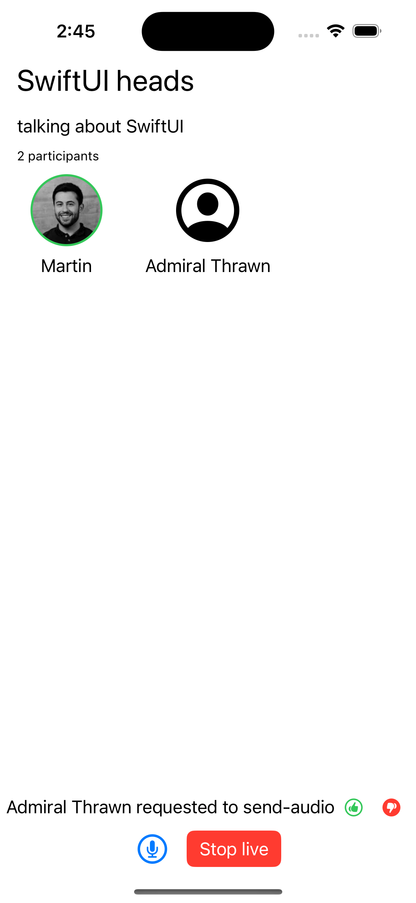
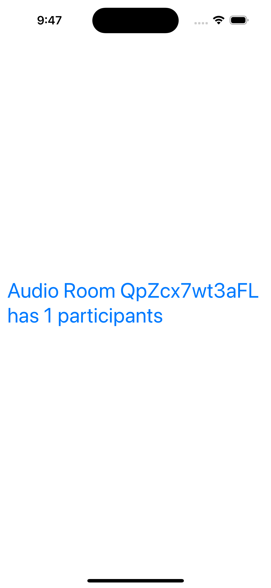
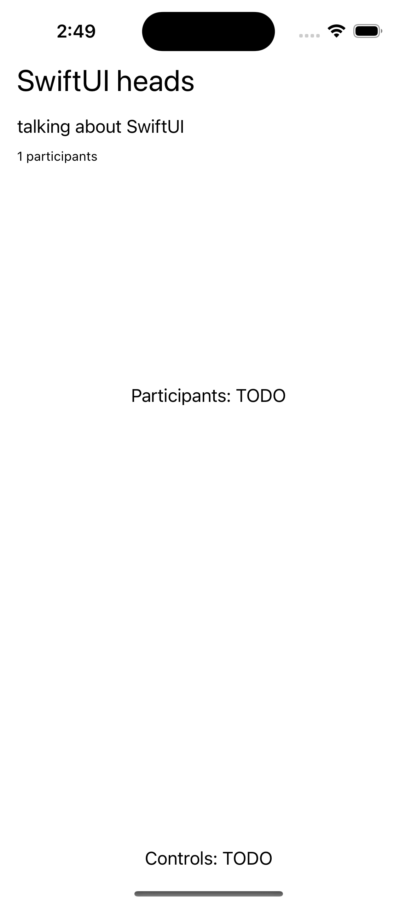
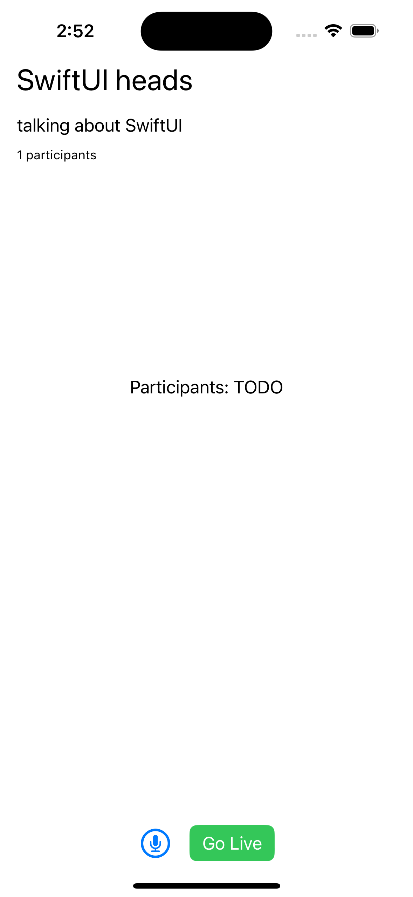
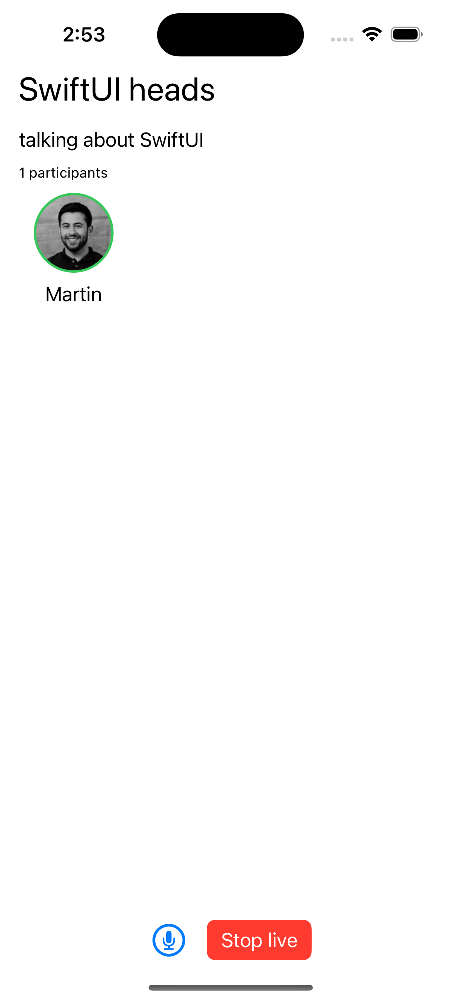
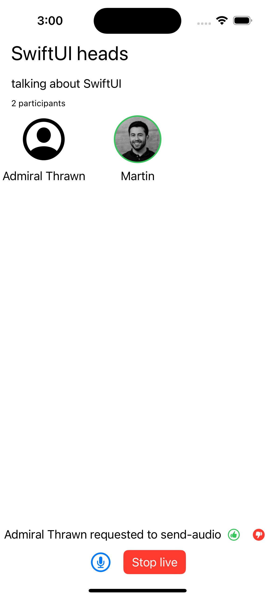
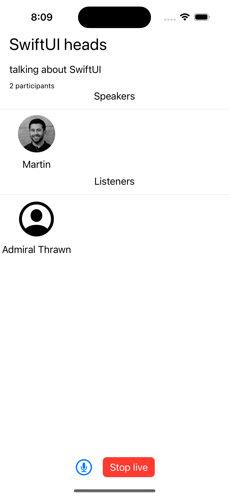

import { TokenSnippet } from '../../../shared/_tokenSnippet.jsx';

This tutorial will teach you how to build an audio room experience like Twitter Spaces or Clubhouse.
The end result will look like the image on the right and support the following features:

* Backstage mode. You can start the call with your co-hosts and chat a bit before going live
* Calls run on Stream's global edge network for optimal latency and scalability
* There is no cap to how many listeners you can have in a room
* Listeners can raise their hand, and be invited to speak by the host
* Audio tracks are send multiple times for optimal reliability



Time to get started building an audio-room for your app.

### Step 1 - Create a new SwiftUI Application in Xcode

1. Make sure you have Xcode installed and that you are running 14.3 or later
2. Open Xcode and select "Create a new Project"
3. Select "iOS" as the platform and "App" as the type of Application
4. Name your project "AudioRooms" and select "SwiftUI" as the interface

### Step 2 - Install the SDK & Setup permissions

Next you need to add our SDK dependencies to your project using Swift Package Manager from Xcode.

1. Click on "Add packages..." from the File menu
2. Add https://github.com/GetStream/stream-video-swift in the search bar
3. Select "StreamVideo" and "StreamVideoSwiftUI" and then click Add Package

#### App Permissions

Joining an audio room requires microphone access, you need to request permissions to use them in your app. In order to do this, you will need to add the following key to the `Info.plist` file.

- `Privacy - Microphone Usage Description` - "AudioRooms requires microphone access in order to capture and transmit audio"


### Step 3 - Create & Join a call

Open up `AudioRooms/AudioRoomsApp.swift` and replace it with this code:

```swift title="AudioRooms/AudioRoomsApp.swift"
import SwiftUI
import StreamVideo

@main
struct AudioRoomsApp: App {
    @State var call: Call
    @ObservedObject var state: CallState
    @State private var callCreated: Bool = false

    private var client: StreamVideo
    private let apiKey: String = "" // The API key can be found in the Credentials section
    private let userId: String = "" // The User Id can be found in the Credentials section
    private let token: String = "" // The Token can be found in the Credentials section
    private let callId: String = "" // The CallId can be found in the Credentials section

    init() {
        let user = User(
            id: userId,
            name: "Martin", // name and imageURL are used in the UI
            imageURL: .init(string: "https://getstream.io/static/2796a305dd07651fcceb4721a94f4505/a3911/martin-mitrevski.webp")
        )

        // Initialize Stream Video client
        self.client = StreamVideo(
            apiKey: apiKey,
            user: user,
            token: .init(stringLiteral: token)
        )

        // Initialize the call object
        let call = client.call(callType: "audio_room", callId: callId)

        self.call = call
        self.state = call.state
    }

    var body: some Scene {
        WindowGroup {
            VStack {
                if callCreated {
                    Text("Audio Room \(call.callId) has \(call.state.participantCount) participants")
                        .font(.system(size: 30))
                        .foregroundColor(.blue)
                } else {
                    Text("loading...")
                }
            }.task {
                Task {
                    guard !callCreated else { return }
                    try await call.join(
                        create: true,
                        options: .init(
                            members: [
                                .init(userId: "john_smith"),
                                .init(userId: "jane_doe"),
                            ],
                            custom: [
                                "title": .string("SwiftUI heads"),
                                "description": .string("Talking about SwiftUI")
                            ]
                        )
                    )
                    callCreated = true
                }
            }
        }
    }
}
```

Let's review the example above and go over the details.

**User** setup. First we create a user object.
You typically sync your users via a server side integration from your own backend.
Alternatively, you can also use guest or anonymous users.

```swift
let user = User(
    id: userId,
    name: "Martin"
)
```

**Client init**. Next we initialize the client by passing the API Key, user and user token.

```swift
self.client = StreamVideo(
    apiKey: apiKey,
    user: user,
    token: .init(stringLiteral: token)
)
```

**Create and join call** After the user and client are created, we create a call like this:

```swift
self.call = client.call(callType: "audio_room", callId: callId)

try await call.join(
    create: true,
    options: .init(
        members: [
            .init(userId: "john_smith"),
            .init(userId: "jane_doe"),
        ],
        custom: [
            "title": .string("SwiftUI heads"),
            "description": .string("Talking about SwiftUI")
        ]
    )
)
```

* This joins and creates a call with the type: "audio_room" and the specified callId
* The users with id `john_smith` and `jane_doe` are added as members to the call
* And we set the `title` and `description` custom field on the call object

To actually run this sample we need a valid user token. The user token is typically generated by your server side API.
When a user logs in to your app you return the user token that gives them access to the call.
To make this tutorial easier to follow we'll generate a user token for you:

Please update **REPLACE_WITH_USER_ID**, **REPLACE_WITH_TOKEN** and **REPLACE_WITH_CALL_ID** with the actual values shown below:

<TokenSnippet sampleApp='audio-rooms' />

With valid credentials in place, we can join the call. When you run the app you'll see the following:



### Step 4 - Adding audio room UI elements

In this next step we'll add:

- Room title and description
- Controls to toggle live mode on/off
- A list of participants with their speaking status

#### Room Title & Description

Let's create the components we need to render this and add them to the main app view

```swift title=DescriptionView
struct DescriptionView: View {
    var title: String?
    var description: String?
    var participants: [CallParticipant]

    var body: some View {
        VStack {
            VStack {
                Text("\(title ?? "")")
                  .font(.title)
                  .frame(maxWidth: .infinity, alignment: .leading)
                  .lineLimit(1)
                  .padding([.bottom], 8)

                Text("\(description ?? "")")
                  .font(.body)
                  .frame(maxWidth: .infinity, alignment: .leading)
                  .lineLimit(1)
                  .padding([.bottom], 4)

                Text("\(participants.count) participants")
                  .font(.caption)
                  .frame(maxWidth: .infinity, alignment: .leading)
            }.padding([.leading, .trailing])
        }
    }
}
```

```swift title=ParticipantsView
struct ParticipantsView: View {
    var participants: [CallParticipant]

    var body: some View {
        Spacer()
        Text("Participants: TODO").font(.body)
        Spacer()
    }
}
```

```swift title=ControlsView
struct ControlsView: View {
    @State var call: Call
    @ObservedObject var state: CallState

    var body: some View {
        Text("Controls: TODO").font(.body)
    }
}
```

That's it for the basics, here's how the app Scene should look like now:

```swift
var body: some Scene {
    WindowGroup {
        VStack {
            if callCreated {
                DescriptionView(
                    title: call.state.custom["title"]?.stringValue,
                    description: call.state.custom["description"]?.stringValue,
                    participants: call.state.participants
                )
                ParticipantsView(
                    participants: call.state.participants
                )
                Spacer()
                ControlsView(call: call, state: state)
            } else {
                Text("loading...")
            }
        }.task {
            Task {
                guard !callCreated else { return }
                try await call.join(
                    create: true,
                    options: .init(
                        members: [
                            .init(userId: "john_smith"),
                            .init(userId: "jane_doe"),
                        ],
                        custom: [
                            "title": .string("SwiftUI heads"),
                            "description": .string("talking about SwiftUI")
                        ]
                    )
                )
                callCreated = true
            }
        }
    }
}
```

If you run the app now, it should look like this:



The approach is the same for all components. We take the states of the call by observing `call.state` published vars, such as `call.state.participants` and use it to power our UI.

To make this a little more interactive let's join the audio room from the browser.

<TokenSnippet sampleApp='audio-rooms' displayStyle='join' />

#### Backstage & Live mode control

As you probably noticed by opening the same room from the browser, audio rooms by default are not live. Regular users can only join an audio room when it is in live mode. Let's expand the ControlView and add a button that controls the backstage or the room.

```swift title=MicButtonView
struct MicButtonView: View {
    var body: some View {
        Button {
           Task {
               print("handle mic tap")
           }
        } label: {
            Label("", systemImage: "mic.circle").font(.title)
        }
    }
}
```

```swift title=LiveButtonView
struct LiveButtonView: View {
    var call: Call
    @ObservedObject var state: CallState

    var body: some View {
        if state.backstage {
            Button {
                Task {
                    try await call.goLive()
                }
            } label: {
                Text("Go Live")
            }
            .buttonStyle(.borderedProminent).tint(.green)
        } else {
            Button {
                Task {
                    try await call.stopLive()
                }
            } label: {
                Text("Stop live")
            }
            .buttonStyle(.borderedProminent).tint(.red)
        }
    }
}
```

```swift title=ControlsView
struct ControlsView: View {
    var call: Call
    @ObservedObject var state: CallState

    var body: some View {
        HStack {
            MicButtonView()
            LiveButtonView(call: call, state: state)
        }
    }
}
```

Now the app exposes a fake mic control button (more on that later) and a button that allows to toggle live mode on/off. If you try the web demo of the audio room you should be able to join as a regular user.



#### List Participants

As a next step, let's render the actual list of participants and show an indicator when they are speaking. To do this we are going to create a `ParticipantView` and render it from the `ParticipantsView`

```swift title=ParticipantView
struct ParticipantView: View {
    var participant: CallParticipant
    var body: some View {
        VStack{
            ZStack {
                Circle()
                    .fill(participant.isSpeaking ? .green : .white)
                    .frame(width: 68, height: 68)
                AsyncImage(
                    url: participant.profileImageURL,
                    content: { image in
                        image.resizable()
                            .aspectRatio(contentMode: .fit)
                            .frame(maxWidth: 64, maxHeight: 64)
                            .clipShape(Circle())
                    },
                    placeholder: {
                        Image(systemName: "person.crop.circle").font(.system(size: 60))
                    }
                )
            }
            Text("\(participant.name)")
        }
    }
}
```

```swift title=ParticipantsView
struct ParticipantsView: View {
    var participants: [CallParticipant]

    var body: some View {
        LazyVGrid(columns: [GridItem(.adaptive(minimum: 100))], spacing: 20) {
            ForEach(participants) {
                ParticipantView(participant: $0)
            }
        }
    }
}
```

With these changes things get more interesting, the app is now showing a list of all participants connected to the call and displays a small circle next to the ones that are speaking.



### Step 5 - Go live and join from the browser

If you now join the call from the browser you will see that the participant list updates as you open/close the browser tab.

Note how the web interface won't allow you to share your audio/video. The reason for this is that by default the audio_room call type only allows moderators or admins to speak. Regular participants can request permission. And if different defaults make sense for your app you can edit the call type in the dashboard or create your own.

### Step 6 - Requesting permission to speak

Requesting permission to speak is easy. Let's first have a quick look at how the SDK call object exposes this:

#### Requesting permission to speak

```swift
let response = try await call.request(permissions: [.sendAudio])
```

#### Handling permission requests

Permission requests are exposed from `call.state` on the `permissionRequests` published variable.

```swift
if let request = call.state.permissionRequests.first {
    // reject it
    request.reject()

    // grant it
    try await call.grant(request: request)
}
```

Let's add another view that shows the last incoming request as well as the buttons to grant / reject it

```swift title=PermissionRequestsView
struct PermissionRequestsView: View {
    var call: Call
    @ObservedObject var state: CallState

    var body: some View {
        if let request = state.permissionRequests.first {
            HStack {
                Text("\(request.user.name) requested to \(request.permission)")
                Button {
                   Task {
                       try await call.grant(request: request)
                   }
                } label: {
                    Label("", systemImage: "hand.thumbsup.circle").tint(.green)
                }
                Button(action: request.reject) {
                    Label("", systemImage: "hand.thumbsdown.circle.fill").tint(.red)
                }
            }
        }
    }
}
```

And here is the updated Scene code that includes it:

```swift
var body: some Scene {
    WindowGroup {
        VStack {
            if callCreated {
                DescriptionView(
                    title: call.state.custom["title"]?.stringValue,
                    description: call.state.custom["description"]?.stringValue,
                    participants: call.state.participants
                )
                ParticipantsView(
                    participants: call.state.participants
                )
                Spacer()
                PermissionRequestsView(call: call, state: state)
                ControlsView(call: call, state: state)
            } else {
                Text("loading...")
            }
        }.task {
            Task {
                guard !callCreated else { return }
                try await call.join(
                    create: true,
                    options: .init(
                        members: [
                            .init(userId: "john_smith"),
                            .init(userId: "jane_doe"),
                        ],
                        custom: [
                            "title": .string("SwiftUI heads"),
                            "description": .string("Talking about SwiftUI")
                        ]
                    )
                )
                callCreated = true
            }
        }
    }
}
```

Now when a user requests access to speak the app will look like this:



### Step 7 - Add microphone control

You can read & manage the microphone status from the `call.microphone` published variable. 

```swift
/// Read the microphone's status
let isEnabled = call.microphone.status == .enabled

/// Toggle between enabled/disabled microphone status.
try await call.microphone.toggle()

/// Enable the microphone.
try await call.microphone.enable()

/// Disable the microphone.
try await call.microphone.disable()
```

Let's update the `MicButtonView` with microphone handling.

```swift title=MicButtonView
struct MicButtonView: View {
    @ObservedObject var microphone: MicrophoneManager

    var body: some View {
        Button {
           Task {
               try await microphone.toggle()
           }
        } label: {
            Image(systemName: microphone.status == .enabled ? "mic.circle" : "mic.slash.circle")
                .foregroundColor(microphone.status == .enabled ? .red : .primary)
                .font(.title)
        }
    }
}
```

We can now pass the `microphone` ObservedObject from the `ControlsView`

```swift title=ControlsView
struct ControlsView: View {
    var call: Call
    @ObservedObject var state: CallState

    var body: some View {
        HStack {
            MicButtonView(microphone: call.microphone)
            LiveButtonView(call: call, state: state)
        }
    }
}
```

### Step 8 - Group participants

It is common for audio rooms and similar interactive audio/video experiences to show users in separate groups. Let's see how we can update this application to render participants in two separate sections: speakers and listeners.

Building custom layouts is very simple, all we need to do is to apply some filtering to the `call.participants` observable.

```swift
// a list of participants, by default this is list is ordered by the ID of the user
call.state.participants

// Speakers: participants that have an audio track (ie. are allowed to speak and have a mic configured)
call.state.participants.filter { $0.hasAudio }

// Listeners: participants that do not have an audio track
call.state.participants.filter { !$0.hasAudio }
```

We already have a view to display participants so all we need to do is to create another one, here's how the scene body looks

```swift
var body: some Scene {
    WindowGroup {
        VStack {
            if callCreated {
                DescriptionView(
                    title: call.state.custom["title"]?.stringValue,
                    description: call.state.custom["description"]?.stringValue,
                    participants: call.state.participants
                )
                Text("Speakers")
                Divider()
                ParticipantsView(
                    participants: call.state.participants.filter {$0.hasAudio}
                )
                Text("Listeners")
                Divider()
                ParticipantsView(
                    participants: call.state.participants.filter {!$0.hasAudio}
                )
                Spacer()
                PermissionRequestsView(call: call, state: state)
                ControlsView(call: call, state: state)
            } else {
                Text("loading...")
            }
        }.task {
            Task {
                guard !callCreated else { return }
                try await call.join(
                    create: true,
                    options: .init(
                        members: [
                            .init(userId: "john_smith"),
                            .init(userId: "jane_doe"),
                        ],
                        custom: [
                            "title": .string("SwiftUI heads"),
                            "description": .string("Talking about SwiftUI")
                        ]
                    )
                )
                try await call.sendReaction(type: "raise-hand", custom: ["mycustomfield": "hello"], emojiCode: ":smile:")
                callCreated = true
            }
        }
    }
}
```



## Other built-in features
There are a few more exciting features that you can use to build audio rooms

- **Query Calls:** You can query calls to easily show upcoming calls, calls that recently finished as well as call previews.
- **Reactions & Custom events:** Reactions and custom events are supported.
- **Recording & Broadcasting:** You can record your calls Chat Stream's chat SDKs are fully featured, and you can integrate them in the call.
- **Moderation:** Moderation capabilities are built-in to the product
- **Transcriptions:** Transcriptions aren't available yet, but they are due to launch soon

## Recap
It was fun to see just how quickly you can build an audio-room for your app. Please do let us know if you ran into any issues. Our team is also happy to review your UI designs and offer recommendations on how to achieve it with Stream.

To recap what we've learned:

- You set up a call with call = client.call(callType: "audio_room", callId: "123")
- The call type "audio_room" controls which features are enabled and how permissions are set up
- The audio_room by default enables "backstage" mode, and only allows admins and the creator of the call to join before the call goes live
- When you join a call, realtime communication is set up for audio & video calling: call.join()
- State objects in `call.state` and `call.state.participants` make it easy to build your own UI
- Calls run on Stream's global edge network of video servers. Being closer to your users improves the latency and reliability of calls. For audio rooms we use Opus RED and Opus DTX for optimal audio quality.

The SDKs enable you to build audio rooms, video calling and livestreaming in days.

We hope you've enjoyed this tutorial and please do feel free to reach out if you have any suggestions or questions. You can find the code for this tutorial in [this Github repository](https://github.com/GetStream/stream-video-ios-examples/).