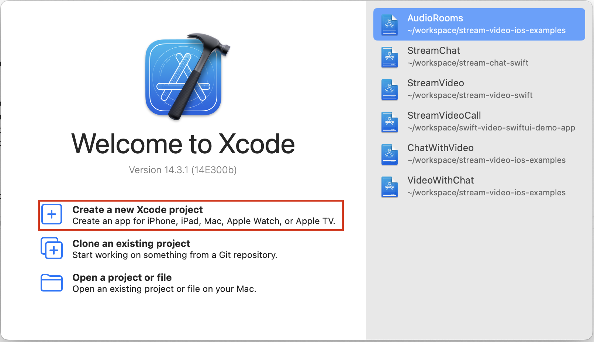
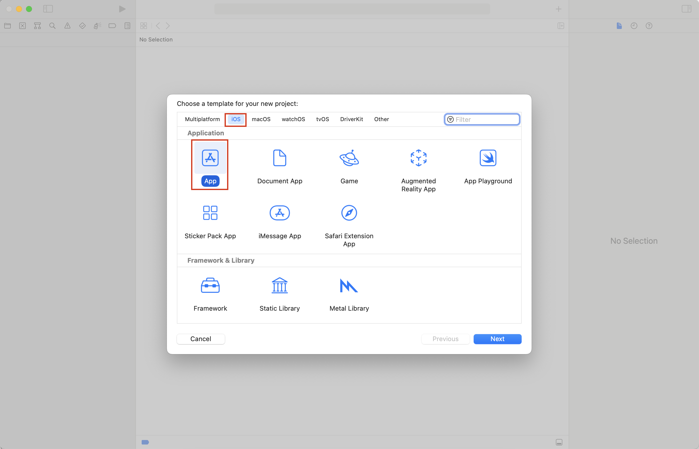
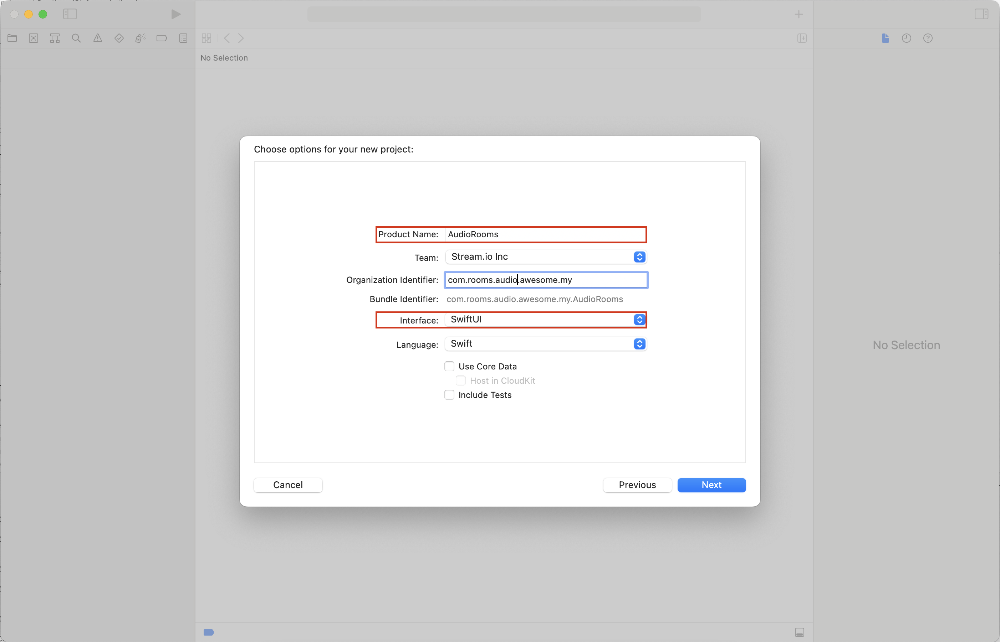
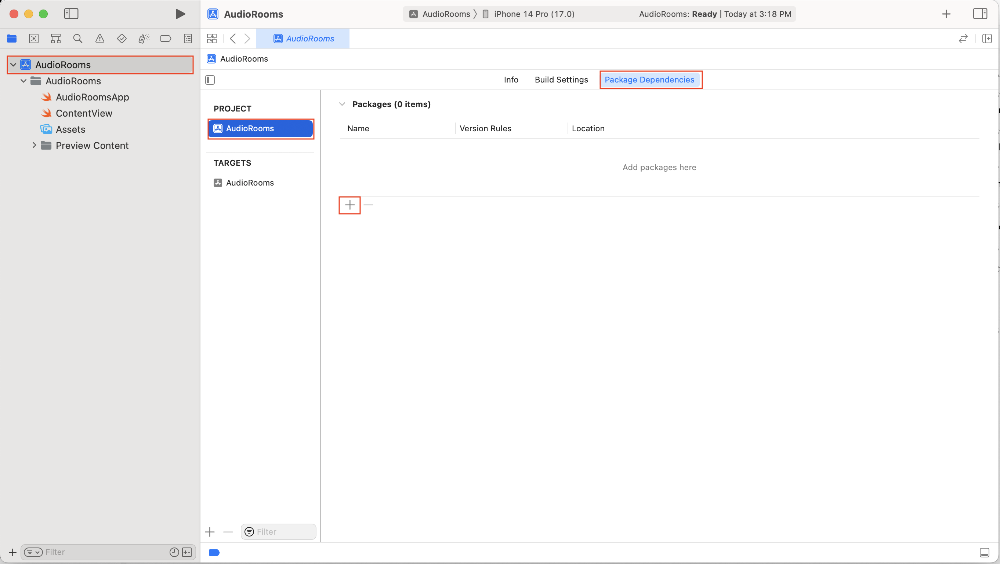
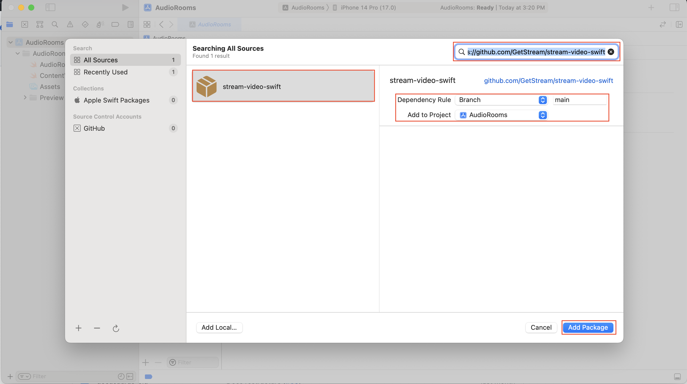
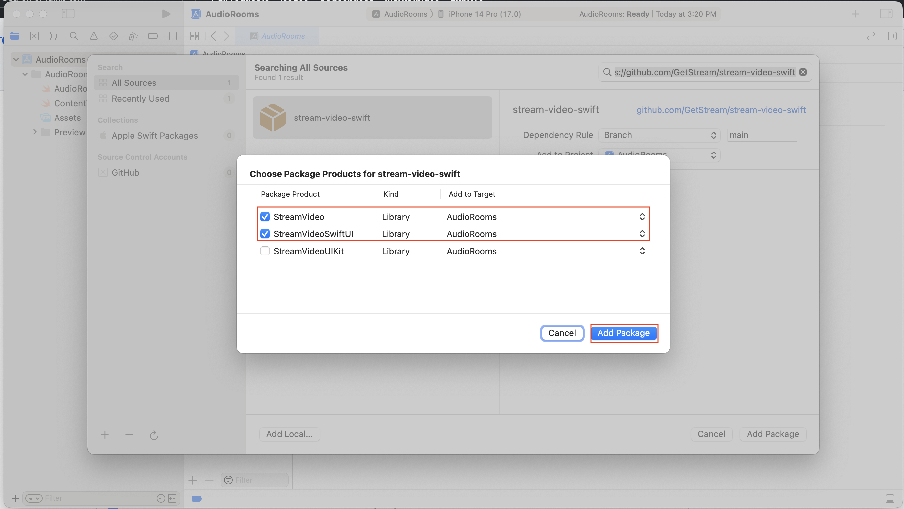

import { TokenSnippet } from '../../../shared/_tokenSnippet.jsx';

This tutorial will teach you how to build an audio room experience like Twitter Spaces or Clubhouse.
The end result will look like the image on the right and support the following features:

* Backstage mode. You can start the call with your co-hosts and chat a bit before going live
* Calls run on Stream's global edge network for optimal latency and scalability
* There is no cap to how many listeners you can have in a room
* Listeners can raise their hand, and be invited to speak by the host
* Audio tracks are send multiple times for optimal reliability

## TODO INSERT SCREENSHOT IMAGE OF THE APP

Time to get started building an audio-room for your app.

### Step 1 - Create a new project in Xcode
| Create a new Project in Xcode | Select iOS as the platform and then select app as the type. | Name your project "AudioRooms" and select SwiftUI as your UI setup. |
|---|---|---|
||||


### Step 2 - Install the SDK & Setup permissions

#### Add the SwiftUI SDK as dependency to your Xcode Project.

| Open Project's settings | Add the package's URL (https://github.com/GetStream/stream-video-swift) in the search bar | Add the following SDK to your target |
|---|---|---|
||||

### Permissions

Making a video call requires the usage of the camera and the microphone of the device. Therefore, you need to request permissions to use them in your app. In order to do this, you will need to add the following keys and values in your `Info.plist` file.

- `Privacy - Camera Usage Description` - "AudioRooms requires camera access in order to capture and transmit video"
- `Privacy - Microphone Usage Description` - "AudioRooms requires microphone access in order to capture and transmit audio"


### Step 3 - Create & Join a call

Open up `AudioRooms/AudioRoomsApp.swift` and replace it with this code:

```swift title="AudioRooms/AudioRoomsApp.swift"
import SwiftUI
import StreamVideo

@main
struct AudioRoomsApp: App {
    @State var call: Call
    @ObservedObject var state: CallState
    @State private var callCreated: Bool = false

    private var client: StreamVideo
    private let apiKey: String = "" // The API key can be found in the Credentials section
    private let userId: String = "" // The User Id can be found in the Credentials section
    private let token: String = "" // The Token can be found in the Credentials section
    private let callId: String = "" // The CallId can be found in the Credentials section

    init() {
        let user = User(
            id: userId,
            name: "Tutorial" // name is used in the UI
        )

        // Initialize Stream Video client
        self.client = StreamVideo(
            apiKey: apiKey,
            user: user,
            token: .init(stringLiteral: token)
        )

        // Initialize the call object
        let call = client.call(callType: "audio_room", callId: callId)

        self.call = call
        self.state = call.state
    }

    var body: some Scene {
        WindowGroup {
            Group {
                if callCreated {
                    Text("Call \(call.callId) has \(call.state.participantCount) participants")
                        .font(.system(size: 30))
                        .foregroundColor(.blue)
                } else {
                    Text("loading...")
                }
            }.task {
                Task {
                    guard !callCreated else { return }
                    try await call.join(
                        create: true,
                        options: .init(
                            members: [
                                .init(userId: "tommaso"),
                                .init(userId: "thierry"),
                            ],
                            custom: [
                                "title": .string("SwiftUI heads"),
                                "description": .string("talking about SwiftUI")
                            ]
                        )
                    )
                    callCreated = true
                }
            }
        }
    }
}
```

Let's review the example above and go over the details.

**User** setup. First we create a user object.
You typically sync your users via a server side integration from your own backend.
Alternatively, you can also use guest or anonymous users.

```swift
let user = User(
    id: userId,
    name: "Tutorial" // name is used in the UI
)
```

**Client init**. Next we initialize the client by passing the API Key, user and user token.

```swift
self.client = StreamVideo(
    apiKey: apiKey,
    user: user,
    token: .init(stringLiteral: token)
)
```

**Create and join call** After the user and client are created, we create a call like this:

```swift
self.call = client.call(callType: "audio_room", callId: callId)

try await call.join(
    create: true,
    options: .init(
        members: [
            .init(userId: "tommaso"),
            .init(userId: "thierry"),
        ],
        custom: [
            "title": .string("SwiftUI heads"),
            "description": .string("talking about SwiftUI")
        ]
    )
)
```

* This joins and creates a call with the type: "audio_room" and the specified callId
* The users with id jack and sophia are added
* And we set the `title` and `description` custom field on the call object

To actually run this sample we need a valid user token. The user token is typically generated by your server side API.
When a user logs in to your app you return the user token that gives them access to the call.
To make this tutorial easier to follow we'll generate a user token for you:

Please update **REPLACE_WITH_USER_ID**, **REPLACE_WITH_TOKEN** and **REPLACE_WITH_CALL_ID** with the actual values shown below:

<TokenSnippet sampleApp='audio-rooms' />

### Step 4 - Adding audio room UI elements

In this next step we'll add:

- Room title, room description
- A list of participants
- An indicator for who's speaking

Let's create a component for the active speaker and the list of participants.

```swift
struct ParticipantView: View {
    var participant: CallParticipant
    var body: some View {
        HStack {
            Text("\(participant.name) - \(participant.roles.joined(separator: ","))")
                .frame(maxWidth: .infinity, maxHeight: .infinity, alignment: .leading)

            if participant.isSpeaking {
                Circle()
                    .fill(Color.blue)
                    .frame(width: 15, height: 15)
            }
        }
    }
}
```

And then update the App to render participants and a button to toggle live mode on/off.
```swift
    Group {
       if callCreated {
          VStack {
             VStack {
                   Text("\(call.state.custom["title"]?.stringValue ?? "")")
                      .font(.title)
                      .frame(maxWidth: .infinity, alignment: .leading)
                      .lineLimit(1)
                      .padding([.bottom], 8)

                   Text("\(call.state.custom["description"]?.stringValue ?? "")")
                      .font(.body)
                      .frame(maxWidth: .infinity, alignment: .leading)
                      .lineLimit(1)
                      .padding([.bottom], 4)

                 Text("CallID: \(call.callId) \(state.participants.count) participants")
                      .font(.caption)
                      .frame(maxWidth: .infinity, alignment: .leading)
             }
             .padding([.leading, .trailing])
              List {
                  ForEach(Array(state.participants.keys), id: \.self) {
                      ParticipantView(participant: state.participants[$0]!)
                  }
              }
              if call.state.backstage {
                   Button {
                      Task {
                         try await call.goLive()
                      }
                   } label: {
                      Text("Go Live")
                         .frame(maxWidth: .infinity)
                   }
                   .padding([.leading, .trailing])
                   .buttonStyle(.borderedProminent)
              } else {
                  Button {
                     Task {
                        try await call.stopLive()
                     }
                  } label: {
                     Text("Stop live")
                        .frame(maxWidth: .infinity)
                  }
                  .padding([.leading, .trailing])
                  .buttonStyle(.borderedProminent)
              }
          }
       } else {
          Text("loading...")
       }
    }
```

The app file should now look like this:

```swift title="AudioRooms/AudioRoomsApp.swift"
import SwiftUI
import StreamVideo


@main
struct AudioRoomsApp: App {
    @State var call: Call
    @ObservedObject var state: CallState
    @State private var callCreated: Bool = false

    private var client: StreamVideo
    private let apiKey: String = "" // The API key can be found in the Credentials section
    private let userId: String = "" // The User Id can be found in the Credentials section
    private let token: String = "" // The Token can be found in the Credentials section
    private let callId: String = "" // The CallId can be found in the Credentials section

    init() {
        let user = User(
            id: userId,
            name: "Tutorial" // name is used in the UI
        )

        // Initialize Stream Video client
        self.client = StreamVideo(
            apiKey: apiKey,
            user: user,
            token: .init(stringLiteral: token)
        )

        // Initialize the call object
        let call = client.call(callType: "audio_room", callId: callId)

        self.call = call
        self.state = call.state
    }

    var body: some Scene {
        WindowGroup {
            Group {
               if callCreated {
                  VStack {
                     VStack {
                           Text("\(call.state.custom["title"]?.stringValue ?? "")")
                              .font(.title)
                              .frame(maxWidth: .infinity, alignment: .leading)
                              .lineLimit(1)
                              .padding([.bottom], 8)
                           Text("\(call.state.custom["description"]?.stringValue ?? "")")
                              .font(.body)
                              .frame(maxWidth: .infinity, alignment: .leading)
                              .lineLimit(1)
                              .padding([.bottom], 4)

                         Text("CallID: \(call.callId) \(state.participants.count) participants")
                              .font(.caption)
                              .frame(maxWidth: .infinity, alignment: .leading)
                     }
                     .padding([.leading, .trailing])

                      List {
                          ForEach(Array(state.participants.keys), id: \.self) {
                              ParticipantView(participant: state.participants[$0]!)
                          }
                      }
                      if call.state.backstage {
                           Button {
                              Task {
                                 try await call.goLive()
                              }
                           } label: {
                              Text("Go Live")
                                 .frame(maxWidth: .infinity)
                           }
                           .padding([.leading, .trailing])
                           .buttonStyle(.borderedProminent)
                      } else {
                          Button {
                             Task {
                                try await call.stopLive()
                             }
                          } label: {
                             Text("Stop live")
                                .frame(maxWidth: .infinity)
                          }
                          .padding([.leading, .trailing])
                          .buttonStyle(.borderedProminent)
                      }
                  }
               } else {
                  Text("loading...")
               }
            }.task {
                Task {
                    guard !callCreated else { return }
                    try await call.join(
                        create: true,
                        options: .init(
                            members: [
                                .init(userId: "tommaso"),
                                .init(userId: "thierry"),
                            ],
                            custom: [
                                "title": .string("SwiftUI heads"),
                                "description": .string("talking about SwiftUI")
                            ]
                        )
                    )
                    callCreated = true
                }
            }
        }
    }
}

struct ParticipantView: View {
    var participant: CallParticipant
    var body: some View {
        HStack {
            Text("\(participant.name) - \(participant.roles.joined(separator: ","))")
                .frame(maxWidth: .infinity, maxHeight: .infinity, alignment: .leading)

            if participant.isSpeaking {
                Circle()
                    .fill(Color.blue)
                    .frame(width: 15, height: 15)
            }
        }
    }
}
```

### Step 4 - Go live and join from the browser

Run the sample app now and you will see one participant. Click the go live button to allow participants to join.

To make this a little more interactive let's join the call from your browser. Visit https://getstream.io/video/demos/?id=123&skip-intro=1 and join the call. On your iOS emulator you'll see the text update to 2 participants.

Note how the web interface won't allow you to share your audio/video. The reason for this is that by default the audio_room call type only allows moderators or admins to speak. Regular participants can request permission. And if different defaults make sense for your app you can edit the call type in the dashboard or create your own.

### Step 5 - Requesting permission to speak

Requesting permission to speak is easy.

```swift
let response = try await call.request(permissions: [.sendAudio])

// and next the admin will call
val requests = call.state.permissionRequests.value
for await request in call.subscribe(for: PermissionRequestEvent.self) {
      call.grant(permissions: [.sendAudio], for: request.user.id)
}
```

Here's how we can show requests from users to speak and deny or reject their request.

```swift
import SwiftUI
import StreamVideo


@main
struct AudioRoomsApp: App {
    @State var call: Call
    @ObservedObject var state: CallState
    @State private var callCreated: Bool = false

    private var client: StreamVideo
    private let apiKey: String = "" // The API key can be found in the Credentials section
    private let userId: String = "" // The User Id can be found in the Credentials section
    private let token: String = "" // The Token can be found in the Credentials section
    private let callId: String = "" // The CallId can be found in the Credentials section

    init() {
        let user = User(
            id: userId,
            name: "Tutorial" // name is used in the UI
        )

        // Initialize Stream Video client
        self.client = StreamVideo(
            apiKey: apiKey,
            user: user,
            token: .init(stringLiteral: token)
        )

        // Initialize the call object
        let call = client.call(callType: "audio_room", callId: callId)

        self.call = call
        self.state = call.state
    }

    var body: some Scene {
        WindowGroup {
            Group {
               if callCreated {
                  VStack {
                     VStack {
                         List {
                             ForEach(state.permissionRequests) {
                                 PermissionRequestView(request: $0, call: call)
                             }
                         }
                     }
                     VStack {
                           Text("\(call.state.custom["title"]?.stringValue ?? "")")
                              .font(.title)
                              .frame(maxWidth: .infinity, alignment: .leading)
                              .lineLimit(1)
                              .padding([.bottom], 8)
                           Text("\(call.state.custom["description"]?.stringValue ?? "")")
                              .font(.body)
                              .frame(maxWidth: .infinity, alignment: .leading)
                              .lineLimit(1)
                              .padding([.bottom], 4)

                         Text("CallID: \(call.callId) \(state.participants.count) participants")
                              .font(.caption)
                              .frame(maxWidth: .infinity, alignment: .leading)
                     }
                     .padding([.leading, .trailing])
                      List {
                          ForEach(Array(state.participants.keys), id: \.self) {
                              ParticipantView(participant: state.participants[$0]!)
                          }
                      }
                      if call.state.backstage {
                           Button {
                              Task {
                                 try await call.goLive()
                              }
                           } label: {
                              Text("Go Live")
                                 .frame(maxWidth: .infinity)
                           }
                           .padding([.leading, .trailing])
                           .buttonStyle(.borderedProminent)
                      } else {
                          Button {
                             Task {
                                try await call.stopLive()
                             }
                          } label: {
                             Text("Stop live")
                                .frame(maxWidth: .infinity)
                          }
                          .padding([.leading, .trailing])
                          .buttonStyle(.borderedProminent)
                      }
                  }
               } else {
                  Text("loading...")
               }
            }.task {
                Task {
                    guard !callCreated else { return }
                    try await call.join(
                        create: true,
                        options: .init(
                            members: [
                                .init(userId: "tommaso"),
                                .init(userId: "thierry"),
                            ],
                            custom: [
                                "title": .string("SwiftUI heads"),
                                "description": .string("talking about SwiftUI")
                            ]
                        )
                    )
                    callCreated = true
                }
            }
        }
    }
}

struct ParticipantView: View {
    var participant: CallParticipant
    var body: some View {
        HStack {
            Text("\(participant.name) - \(participant.roles.joined(separator: ","))")
                .frame(maxWidth: .infinity, maxHeight: .infinity, alignment: .leading)

            if participant.isSpeaking {
                Circle()
                    .fill(Color.blue)
                    .frame(width: 15, height: 15)
            }
        }
    }
}

struct PermissionRequestView: View {
    var request: PermissionRequest
    var call: Call
    var body: some View {
        HStack(alignment: .top) {
            Text("\(request.user.name) requested to \(request.permission)").frame(maxWidth: .infinity, maxHeight: .infinity, alignment: .leading).font(.system(size: 11))
            Button {
               Task {
                   try await call.grant(request: request)
               }
            } label: {
                Label("", systemImage: "hand.thumbsup.circle")
            }
            Button(action: request.reject) {
                Label("", systemImage: "hand.thumbsdown.circle.fill")
            }
        }
    }
}
```


## Other built-in features
There are a few more exciting features that you can use to build audio rooms

**Query Calls** You can query calls to easily show upcoming calls, calls that recently finished etc. **Reactions & Custom events** Reactions and custom events are supported. **Recording & Broadcasting** You can record your calls Chat Stream's chat SDKs are fully featured and you can integrate them in the call **Moderation** Moderation capabilities are built-in to the product **Transcriptions** Transcriptions aren't available yet, but they are due to launch soon

## Recap
It was fun to see just how quickly you can build an audio-room for your app. Please do let us know if you ran into any issues. Our team is also happy to review your UI designs and offer recommendations on how to achieve it with Stream.

To recap what we've learned:

- You setup a call: (call = streamVideo?.call(callType: .audioRoom, callId: "123"))
- The call type "audio_room" controls which features are enabled and how permissions are setup
- The audio_room by default enables "backstage" mode, and only allows admins to join before the call goes live
- When you join a call, realtime communication is setup for audio & video calling: (call.join())
- State objects in call.state and call.state.participants make it easy to build your own UI
- Calls run on Stream's global edge network of video servers. Being closer to your users improves the latency and reliability of calls. For audio rooms we use Opus RED and Opus DTX for optimal audio quality.

The SDKs enable you to build audio rooms, video calling and livestreaming in days.

We hope you've enjoyed this tutorial and please do feel free to reach out if you have any suggestions or questions. You can find the code for this tutorial in [this Github repository](https://github.com/GetStream/stream-video-ios-examples/).