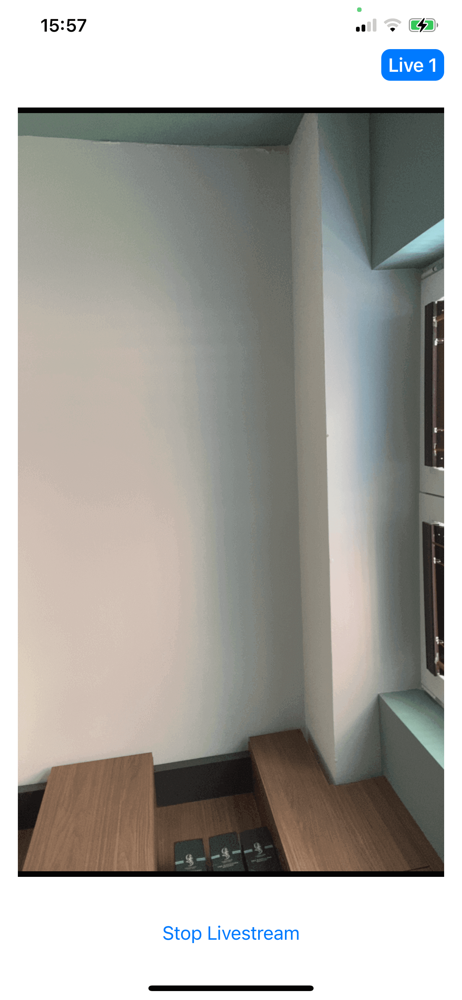

### Livestream Quickstart

In this tutorial we'll quickly build a low-latency in-app livestreaming experience. The livestream is broadcasted using Stream's edge network of servers around the world. We'll cover the following topics:

- Ultra low latency streaming
- Multiple streams & co-hosts
- RTMP in and WebRTC input
- Exporting to HLS
- Reactions, custom events and chat
- Recording & Transcriptions

Let's get started, if you have any questions or feedback be sure to let us know via the feedback button.

### Step 1 - Create a new project in Xcode

### Step 2 - Install the SDK & Setup the client

Please make sure that you have the required setup:
- `StreamVideo` SDK added to your project
- Auth setup and user login
- Required permissions for camera and microphone

### Step 3 - Broadcast a livestream from your phone

The following code shows how to publish from your phone's camera. Let's open LivestreamSampleApp.swift and replace the LivestreamSampleApp struct with the following code:

```swift
struct LivestreamSampleApp: App {

    @State var streamVideo: StreamVideo
    let call: Call
    
    init() {
        let userToken = "REPLACE_WITH_TOKEN"
        let userId = "REPLACE_WITH_USER_ID"
        let callId = "REPLACE_WITH_CALL_ID"
        
        let user = User(id: userId, name: "tutorial")
        
        let streamVideo = StreamVideo(
            apiKey: "YOUR_API_KEY",
            user: user,
            token: .init(rawValue: userToken)
        )
        self.streamVideo = streamVideo
        let call = streamVideo.call(callType: "livestream", callId: callId)
        self.call = call
        Task {
            try await call.join(create: true)
        }
    }
    
    var body: some Scene {
        WindowGroup {
            LivestreamView(call: call)
        }
    }
}

struct LivestreamView: View {
    
    let call: Call
    
    var body: some View {
        Text("TODO: render video")
    }
    
}
```

You'll notice that these first 3 lines need their values replaced.

```swift
let userToken = "REPLACE_WITH_TOKEN"
let userId = "REPLACE_WITH_USER_ID"
let callId = "REPLACE_WITH_CALL_ID"
```

Replace them now with the values shown below:

<TokenSnippet sampleApp='livestream' displayStyle='credentials' />

When you run the app now you'll see a text message saying: "TODO: render video".
Before we get around to rendering the video let's review the code above.

In the first step we setup the user:

```swift
let user = User(id: userId, name: "tutorial")
```

If you don't have an authenticated user you can also use a guest or anonymous user.
For most apps it's convenient to match your own system of users to grant and remove permissions.

Next we create the client:

```swift
let streamVideo = StreamVideo(
    apiKey: "YOUR_API_KEY",
    user: user,
    token: .init(rawValue: userToken)
)
```

You'll see the `userToken` variable. Your backend typically generates the user token on signup or login.

The most important step to review is how we create the call.
Stream uses the same call object for livestreaming, audio rooms and video calling.
Have a look at the code snippet below:

```swift
let call = streamVideo.call(callType: "livestream", callId: callId)
Task {
    try await call.join(create: true)
}
```

To create the first call object, specify the call type as **livestream** and provide a unique **callId**. The **livestream** call type comes with default settings that are usually suitable for livestreams, but you can customize features, permissions, and settings in the dashboard. Additionally, the dashboard allows you to create new call types as required.

Finally, using `call.join(create: true)` will not only create the call object on our servers but also initiate the real-time transport for audio and video. This allows for seamless and immediate engagement in the livestream.

Note that you can also add members to a call and assign them different roles. For more information, see the [call creation docs](../03-guides/02-joining-creating-calls.mdx)

### Step 4 - Rendering the video

In this step we're going to build a UI for showing your local video with a button to start the livestream. This example uses SwiftUI, but you could also use UIKit.

In LivestreamSampleApp.swift replace the LivestreamView with the following code:

```swift
struct LivestreamView: View {
    
    @Injected(\.streamVideo) var streamVideo
    
    let call: Call
    
    @StateObject var state: CallState
    
    init(call: Call) {
        self.call = call
        _state = StateObject(wrappedValue: call.state)
    }
    
    var body: some View {
        VStack {
            HStack {
                Spacer()
                
                Text("Live \(state.participantCount)")
                    .bold()
                    .padding(.all, 4)
                    .padding(.horizontal, 2)
                    .foregroundColor(.white)
                    .background(Color.blue)
                    .cornerRadius(8)
                    .opacity(call.state.backstage ? 0 : 1)
                    .padding(.horizontal)
            }
            
            GeometryReader { reader in
                if let first = state.participants.first {
                    VideoRendererView(id: first.id, size: reader.size) { renderer in
                        renderer.handleViewRendering(for: first) { size, participant in }
                    }
                } else {
                    Color(UIColor.secondarySystemBackground)
                }
            }
            .padding()
            
            ZStack {
                if call.state.backstage {
                    Button {
                        Task {
                            try await call.goLive()
                        }
                    } label: {
                        Text("Go Live")
                    }
                } else {
                    Button {
                        Task {
                            try await call.stopLive()
                        }
                    } label: {
                        Text("Stop Livestream")
                    }
                }
            }
            .padding()
        }
        .background(Color(UIColor.systemBackground))
        .navigationBarHidden(true)
    }
    
}
```

Upon running your app, you will be greeted with an interface that looks like this:



Stream uses a technology called SFU cascading to replicate your livestream over different SFUs around the world.
This makes it possible to reach a large audience in realtime.

Now let's press **Go live** in the iOS app and click the link below to watch the video in your browser.

<TokenSnippet sampleApp='livestream' displayStyle='join' />

Let's take a moment to review the SwiftUI code above. `Call.state` exposes all the `@Published` objects you need.

The most important ones are:

```
call.state
call.state.participants
```

The [participant state docs](../03-guides/03-call-and-participant-state.mdx) show all the available data.

The livestream layout is built using standard SwiftUI. The [VideoRenderer](../04-ui-components/02-video-renderer.mdx) component is provided by Stream.
**VideoRenderer** renders the video and a fallback. You can use it for rendering the local and remote video.

### Step 4 - (Optional) Publishing RTMP using OBS

The example above showed how to publish your phone's camera to the livestream.
Almost all livestream software and hardware supports RTMPs.
So let's see how to publish using RTMPs. Feel free to skip this step if you don't need to use RTMPs.

A. Log the URL & Stream Key

```swift
if let rtmp = state.ingress?.rtmp {
    print("RTMP url and streamingKey \(rtmp)")
}
```

For example, you can listen to this value with the `onReceive` modifier:

```swift
.onReceive(state.$ingress) { _ in
    if let rtmp = state.ingress?.rtmp {
        print("RTMP url and streamingKey \(rtmp)")
    }
}
```

B. Open OBS and go to settings -> stream

- Select "custom" service
- Server: equal to the server URL from the log
- Stream key: equal to the stream key from the log

Press start streaming in OBS. The RTMP stream will now show up in your call just like a regular video participant.
Now that we've learned to publish using WebRTC or RTMP let's talk about watching the livestream.

### Step 5 - Viewing a livestream (WebRTC)

Watching a livestream is even easier than broadcasting.

Compared to the current code in in `LivestreamSampleApp.swift` you:

* Don't need to request permissions or enable the camera
* Don't render the local video, but instead render the remote video
* Typically include some small UI elements like viewer count, a button to mute etc.

### Step 6 - (Optional) Viewing a livestream with HLS

Another way to watch a livestream is using HLS. HLS tends to have a 10 to 20 seconds delay, while the above WebRTC approach is realtime.
The benefit that HLS offers is better buffering under poor network conditions.
So HLS can be a good option when:

* A 10-20 second delay is acceptable
* Your users want to watch the Stream in poor network conditions

Let's show how to broadcast your call to HLS:

```kotlin
call.startBroadcast()
val hlsUrl = call.state.egress.value?.hls
Log.i("Tutorial", "HLS url = $hlsUrl")
```

You can view the HLS video feed using any HLS capable video player.

### Step 7 - Advanced Features

This tutorial covered broadcasting and watching a livestream.
It also went into more details about HLS & RTMP-in.

There are several advanced features that can improve the livestreaming experience:

* ** [Co-hosts](../03-guides/02-joining-creating-calls.mdx) ** You can add members to your livestream with elevated permissions. So you can have co-hosts, moderators etc.
* ** [Custom events](../03-guides/08-reactions-and-custom-events.mdx) ** You can use custom events on the call to share any additional data. Think about showing the score for a game, or any other realtime use case.
* ** [Reactions & Chat](../03-guides/08-reactions-and-custom-events.mdx) ** Users can react to the livestream, and you can add chat. This makes for a more engaging experience.
* ** [Notifications](../06-advanced/01-ringing.mdx) ** You can notify users via push notifications when the livestream starts
* ** [Recording](../06-advanced/06-recording.mdx) ** The call recording functionality allows you to record the call with various options and layouts

### Recap

It was fun to see just how quickly you can build in-app low latency livestreaming. Please do let us know if you ran into any issues. Our team is also happy to review your UI designs and offer recommendations on how to achieve it with Stream.

To recap what we've learned:

- WebRTC is optimal for latency, HLS is slower but buffers better for users with poor connections
- You setup a call: (let call = streamVideo.call(callType: "livestream", callId: callId))
- The call type "livestream" controls which features are enabled and how permissions are setup
- The livestream by default enables "backstage" mode. This allows you and your co-hosts to setup your mic and camera before allowing people in
- When you join a call, realtime communication is setup for audio & video: (call.join())
- Observable objects in call.state and call.state.participants make it easy to build your own UI

Calls run on Stream's global edge network of video servers. Being closer to your users improves the latency and reliability of calls. The SDKs enable you to build livestreaming, audio rooms and video calling in days.

We hope you've enjoyed this tutorial and please do feel free to reach out if you have any suggestions or questions.