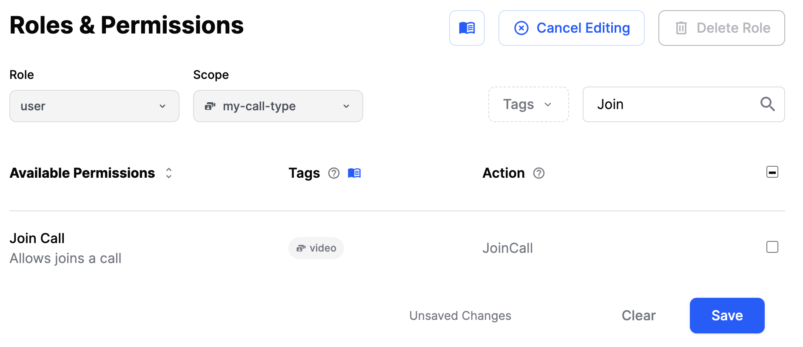
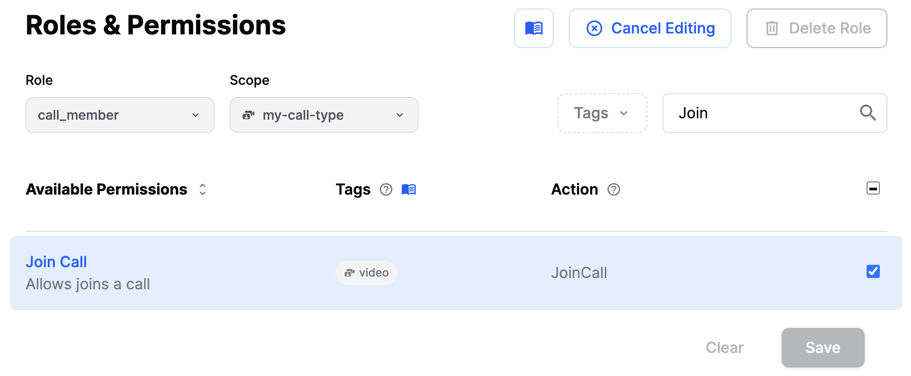

### Creating a call

You create a call by specifying a "call type" and a call id.

```swift
let call = streamVideo.call(callType: "default", callId: "123")
let result = try await call.create()
```

The **call type** controls which features are enabled, and sets up permissions.

For the call id there are a few things to note:

- You can reuse the same call multiple times.
- If you have a unique id for the call we recommend passing that as the id.
- If you don't have a unique id you can leave it empty and we'll generate one for you.

As an example, if you're building a telemedicine app calls will be connected to an appointment. Using your own appointment id as the **call id** makes it easy to find the call later.

### Joining a call

Joining a call sets up the realtime communication for audio and video.

```swift
let call = streamVideo.call(callType: "default", callId: "123")
let result = try await call.join()
```

### Create and join a call

For convenience, you can create and join a call in a single operation. One of the flags you can provide there is `create`.
Set this to `true` if you want to enable creating new call. Set it to `false` if you only want to join an existing call.

```swift
try await call.join(create: true)
```

### Leave call

To leave a call, you can use the `leave` method:

```swift
call.leave()
```

### End call

Ending a call requires a [special permission](../permissions-and-moderation). This action terminates the call for everyone.

```typescript
try await call.end()
```

Only users with special permission can join an ended call.

### Call CRUD

Basic CRUD operations are available on the call object

```swift
// create
let call = streamVideo.call(callType: "default", callId: "123")
let result = try await call.create()

// update
let custom: [String: RawJSON] = ["secret": .string("secret")]
let updateResult = try await call.update(custom: custom)

// get
let getResult = try await call.get()
```

### Call Create Options

Here's a more complete example that shows how to create a call with members and custom data that starts tomorrow and is limited to our team:

```swift
let members = ["thierry", "tommaso"]
let call = streamVideo.call(callType: "default", callId: UUID().uuidString)

let result = try await call.create(
    memberIds: members, 
    custom: ["color": .string("red")], 
    startsAt: Calendar.current.date(byAdding: .day, value: 1, to: Date()),
    team: "stream",
    ring: true,
    notify: false
)
```

Members are permanently associated with a call. It allows you to:

- Restrict the ability to join a call only to members
- Send a push notification to members when the call starts

#### Backstage setup

The backstage feature makes it easy to build a use-case where you and your co-hosts can setup your camera before going live. Only after you call call.goLive() the regular users be allowed to join the livestream.

However, you can also specify a `joinAheadTimeSeconds`, which allows regular users to join the livestream before it is live, in the specified join time before the stream starts.

Here's an example how to do that:

```swift
let call = streamVideo.call(callType: "livestream", callId: callId)
let backstageRequest = BackstageSettingsRequest(
    enabled: true,
    joinAheadTimeSeconds: 300
)
try await call.create(
    members: [.init(userId: "test")],
    startsAt: Date().addingTimeInterval(500),
    backstage: backstageRequest
)
try await call.join()
```

In the code snippet above, we are creating a call that starts 500 seconds from now. We are also enabling backstage mode, with a `joinAheadTimeSeconds` of 300 seconds. That means that regular users will be able to join the call 200 seconds from now.

The following options are supported when creating a call:

| Option | Description | Default |
| ------ | ----------- | ------- |
| `memberIds` | A list of users ids to add as members to this call. | `nil` |
| `members` | A list of members to add to this call. You can specify the role and custom data on these members. | `nil` |
| `custom` | Any custom data you want to store. | `nil` |
| `startsAt` | When the call will start. Used for calls scheduled in the future, livestreams, audio rooms etc. | `nil` |
| `team` | Restrict the access to this call to a specific team. | `nil` |
| `ring` | If you want the call to ring for each member. | `false` |
| `notify` | If you want the call to nofiy each member by sending push notification. | `false` |
| `maxDuration` | If you want to specify a max duration of the call, in seconds. | `nil` |
| `maxParticipants` | If you want to specify the max number of participants in the call. | `nil` |
| `backstage` | If you want to specify backstage setup for the call. | `nil` |

### Querying Members

You can query the members of the call. This is helpful if you have thousands of members in a call and want to paginate.

```swift
let filters: [String: RawJSON] = ["user_id": .string("jaewoong")]
let response = try await call.queryMembers(
    filters: filters,
    sort: [SortParamRequest.descending("created_at")],
    limit: 5
)
```

You can filter the member list on these fields, and sort on the selected fields. Note that you can also query on custom data for the member or the user.

| Option | Description | Sorting Supported |
| ------ | ----------- | ------- |
| `user_id` | The user's id. | Yes |
| `role` | The member's role. | No |
| `custom` | The custom data on the member. | No |
| `created_at` | When the member was created. | Yes |
| `updated_at` | When the member was last updated. | No |

## Restricting access

You can restrict access to a call by tweaking the [Call Type](../configuring-call-types/) permissions and roles.
A typical use case is to restrict access to a call to a specific set of users -> call members.

#### Step 1: Set up the roles and permissions

On our [dashboard](https://dashboard.getstream.io/), navigate to the **Video & Audio -> Roles & Permissions** section and select the appropriate role and scope.
In this example, we will use `my-call-type` scope.

By default, all users unless specified otherwise, have the `user` role.

We start by removing the `JoinCall` permission from the `user` role for the `my-call-type` scope.
It will prevent regular users from joining a call of this type.



Next, let's ensure that the `call_member` role has the `JoinCall` permission for the `my-call-type` scope.
It will allow users with the `call_member` role to join a call of this type.



Once this is set, we can proceed with setting up a `call` instance.

#### Step 2: Set up the call

```swift
let call = streamVideo.call(callType: "my-call-type", callId: "my-call-id")
try await call.create(members: [.init(role: "call_member", userId: "alice")])

// and if necessary, to grant access to more users
try await call.addMembers(members: [.init(role: "call_member", userId: "charlie")])

// or, to remove access from some users
try await call.removeMembers(ids: ["charlie"])
```