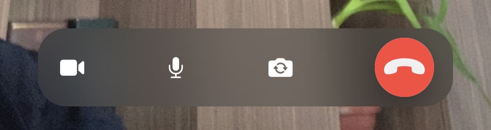

The `CallControls` component lets you display any number of controls on the UI, that trigger different actions within a call. We provide default actions, such as changing the audio and video mute state or turning on the speakerphone and leaving the call.

On top of these actions, you can provide a custom set of actions through the API.

## Adding / removing a button

If you want to customize (or completely replace) the default `CallControlsView`, you should use the `ViewFactory` method `makeCallControlsView`:

```swift
public func makeCallControlsView(viewModel: CallViewModel) -> some View {
    CustomCallControlsView(viewModel: viewModel)
}
```

Next, let's see the `CustomCallControlsView`:

```swift
struct CustomCallControlsView: View {
    
    @ObservedObject var viewModel: CallViewModel
    
    var body: some View {
        HStack(spacing: 32) {
            VideoIconView(viewModel: viewModel)
            MicrophoneIconView(viewModel: viewModel)
            ToggleCameraIconView(viewModel: viewModel)
            HangUpIconView(viewModel: viewModel)
        }
        .frame(maxWidth: .infinity)
        .frame(height: 85)
    }
}
```

The `CustomCallControlsView` is a simple `HStack`, and you can easily add or remove buttons to it, depending on your app's requirements.

### Replacing the call controls

Let's see how we can build our own call controls in the style of Facebook Messenger.



We need to create a different version of the views in the `HStack`, while we still reuse the functionalities of the `CallViewModel` for the actions.

```swift
struct FBCallControlsView: View {
    
    @ObservedObject var viewModel: CallViewModel
    
    var body: some View {
        HStack(spacing: 24) {
            Button {
                viewModel.toggleCameraEnabled()
            } label: {
                Image(systemName: "video.fill")
            }
            
            Spacer()

            Button {
                viewModel.toggleMicrophoneEnabled()
            } label: {
                Image(systemName: "mic.fill")
            }
            
            Spacer()
                        
            Button {
                viewModel.toggleCameraPosition()
            } label: {
                Image(systemName: "arrow.triangle.2.circlepath.camera.fill")
            }
            
            Spacer()
            
            HangUpIconView(viewModel: viewModel)
        }
        .foregroundColor(.white)
        .padding(.vertical, 8)
        .padding(.horizontal)
        .modifier(BackgroundModifier())
        .padding(.horizontal, 32)
    }
    
}
```

Additionally, we need to update the styling, where we use a blurred background with a bigger corner radius.

```swift
struct BackgroundModifier: ViewModifier {
    
    func body(content: Content) -> some View {
        if #available(iOS 15, *) {
            content
                .background(
                    .ultraThinMaterial,
                    in: RoundedRectangle(cornerRadius: 24)
                )
        } else {
            content
                .background(Color.black.opacity(0.8))
                .cornerRadius(24)
        }
    }
    
}
```

Finally, we need to update our `ViewFactory` to use the newly created controls:

```swift
func makeCallControlsView(viewModel: CallViewModel) -> some View {
    FBCallControlsView(viewModel: viewModel)
}
```

That's everything that's needed for having a Facebook Messenger style of call controls. This example showed how easy it is to build your own call controls UI, while using `StreamVideo`'s building blocks.
