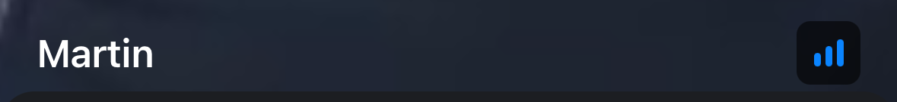

Showing participant info is an important part of the calling experience, and can have different design variations. By default, the SDK shows the name of the participant with white color, in a black container with opacity. Additionally, it shows the connection info, as well as whether the user is pinned.

You can change this default UI by implementing the `makeVideoCallParticipantModifier` in your custom `ViewFactory`. For example, let's simplify this view and just display a bold white name of the participant.



```swift
func makeVideoCallParticipantModifier(
    participant: CallParticipant,
    participantCount: Int,
    pinnedParticipant: Binding<CallParticipant?>,
    availableSize: CGSize,
    ratio: CGFloat
) -> some ViewModifier {
    CustomParticipantModifier(
        participant: participant,
        pinnedParticipant: pinnedParticipant,
        participantCount: participantCount,
        availableSize: availableSize,
        ratio: ratio
    )
}
```

The implementation of the `CustomParticipantModifier` looks like this:

```swift
struct CustomParticipantModifier: ViewModifier {
            
    var participant: CallParticipant
    @Binding var pinnedParticipant: CallParticipant?
    var participantCount: Int
    var availableSize: CGSize
    var ratio: CGFloat
    
    public init(
        participant: CallParticipant,
        pinnedParticipant: Binding<CallParticipant?>,
        participantCount: Int,
        availableSize: CGSize,
        ratio: CGFloat
    ) {
        self.participant = participant
        _pinnedParticipant = pinnedParticipant
        self.participantCount = participantCount
        self.availableSize = availableSize
        self.ratio = ratio
    }
    
    public func body(content: Content) -> some View {
        content
            .adjustVideoFrame(to: availableSize.width, ratio: ratio)
            .overlay(
                ZStack {
                    VStack {
                        Spacer()
                        HStack {
                            Text(participant.name)
                                .foregroundColor(.white)
                                .bold()
                            Spacer()
                            ConnectionQualityIndicator(
                                connectionQuality: participant.connectionQuality
                            )
                        }
                        .padding(.bottom, 2)
                    }
                    .padding()
                    
                    if participant.isSpeaking && participantCount > 1 {
                        Rectangle()
                            .strokeBorder(Color.blue.opacity(0.7), lineWidth: 2)
                    }
                }
            )
    }
}
```

The important part here is the overlay applied to the view. Here, we are using a `ZStack` as a container, while putting the name and the connection quality indicator at the bottom of a `VStack`.