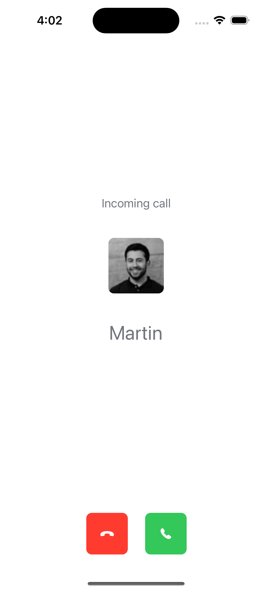

The `IncomingCallView` lets you easily build UI when you're being called or ringed by other people in an app. It's used to show more information about the participants and the call itself, as well as give you the option to reject or accept the call. 

## Custom Incoming Call View

If you want to customize (or completely replace) the `IncomingCallView`, you should use the `ViewFactory` method `makeIncomingCallView`:

```swift
func makeIncomingCallView(viewModel: CallViewModel, callInfo: IncomingCall) -> some View {
    CustomIncomingCallView(callInfo: callInfo, callViewModel: viewModel)
}
```

For example, let's build an incoming call view that can be used in a healthcare app.



Next, let's see how we can build this view:

```swift
struct CustomIncomingCallView: View {
    
    @Injected(\.colors) var colors
    
    @ObservedObject var callViewModel: CallViewModel
    @StateObject var viewModel: IncomingViewModel
                
    init(
        callInfo: IncomingCall,
        callViewModel: CallViewModel
    ) {
        self.callViewModel = callViewModel
        _viewModel = StateObject(
            wrappedValue: IncomingViewModel(callInfo: callInfo)
        )
    }
    
    var body: some View {
        VStack {
            Spacer()
            Text("Incoming call")
                .foregroundColor(Color(colors.textLowEmphasis))
                .padding()
            
            LazyImage(url: callInfo.caller.imageURL)
                .frame(width: 80, height: 80)
                .clipShape(RoundedRectangle(cornerRadius: 8))
                .padding()
            
            Text(callInfo.caller.name)
                .font(.title)
                .foregroundColor(Color(colors.textLowEmphasis))
                .padding()
            
            Spacer()
            
            HStack(spacing: 16) {
                Spacer()
                
                Button {
                    callViewModel.rejectCall(callType: callInfo.type, callId: callInfo.id)
                } label: {
                    Image(systemName: "phone.down.fill")
                        .foregroundColor(.white)
                        .padding()
                        .background(
                            RoundedRectangle(cornerRadius: 8)
                                .fill(Color.red)
                                .frame(width: 60, height: 60)
                        )
                }
                .padding(.all, 8)
                                
                Button {
                    callViewModel.acceptCall(callType: callInfo.type, callId: callInfo.id)
                } label: {
                    Image(systemName: "phone.fill")
                        .foregroundColor(.white)
                        .padding()
                        .background(
                            RoundedRectangle(cornerRadius: 8)
                                .fill(Color.green)
                                .frame(width: 60, height: 60)
                        )
                }
                .padding(.all, 8)
                
                Spacer()
            }
            .padding()
            
        }
        .background(Color.white.edgesIgnoringSafeArea(.all))
    }
    
    var callInfo: IncomingCall {
        viewModel.callInfo
    }
    
}
```

The incoming call view is built from standard SwiftUI components, as well as `StreamLazyImage`, for displaying the caller's avatar. In the view, we just display the data of the `IncomingCall` and we provide buttons to accept or reject the call.