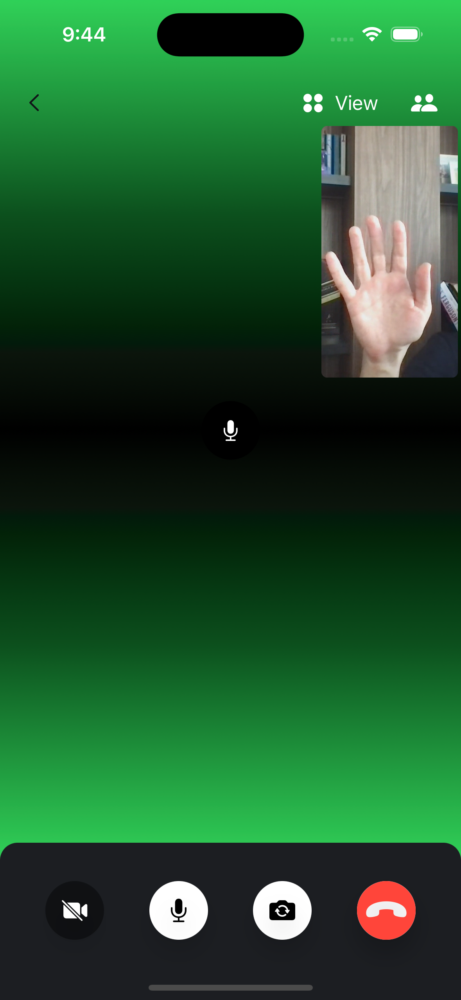

When the video is disabled, there are many different ways to show a placeholder view. By default, the SDK shows a circled image of the user's avatar (if available), and a blurred background of the same image.

You can change this view with any SwiftUI view that fits your app's look and feel.

For example, let's change the video fallback to be a gradient, with a microphone icon in the middle (as an indicator whether the user is speaking).



In order to do this, we need to implement the `makeVideoParticipantView` in our custom `ViewFactory`:

```swift
func makeVideoParticipantView(
    participant: CallParticipant,
    id: String,
    availableFrame: CGRect,
    contentMode: UIView.ContentMode,
    customData: [String: RawJSON],
    call: Call?
) -> some View {
    CustomVideoCallParticipantView(
        participant: participant,
        id: id,
        availableFrame: availableFrame,
        contentMode: contentMode,
        call: call
    )
}
```

The implementation of the `CustomVideoCallParticipantView` looks like this:

```swift
public struct CustomVideoCallParticipantView: View {
    
    @Injected(\.images) var images
    @Injected(\.streamVideo) var streamVideo
        
    let participant: CallParticipant
    var id: String
    var availableFrame: CGRect
    var contentMode: UIView.ContentMode
    var edgesIgnoringSafeArea: Edge.Set
    var call: Call?
    
    public init(
        participant: CallParticipant,
        id: String? = nil,
        availableFrame: CGRect,
        contentMode: UIView.ContentMode,
        edgesIgnoringSafeArea: Edge.Set = .all,
        call: Call?
    ) {
        self.participant = participant
        self.id = id ?? participant.id
        self.availableFrame = availableFrame
        self.contentMode = contentMode
        self.edgesIgnoringSafeArea = edgesIgnoringSafeArea
        self.call = call
    }
    
    public var body: some View {
        VideoRendererView(
            id: id,
            size: availableFrame.size,
            contentMode: contentMode,
            handleRendering: { view in
                view.handleViewRendering(for: participant) { size, participant in
                    Task {
                        await call?.updateTrackSize(size, for: participant)
                    }
                }
            }
        )
        .opacity(showVideo ? 1 : 0)
        .edgesIgnoringSafeArea(edgesIgnoringSafeArea)
        .accessibility(identifier: "callParticipantView")
        .streamAccessibility(value: showVideo ? "1" : "0")
        .overlay(
            CallParticipantImageView(
                id: participant.id,
                name: participant.name,
                imageURL: participant.profileImageURL
            )
            .frame(width: availableFrame.size.width)
            .opacity(showVideo ? 0 : 1)
        )
    }
    
    private var showVideo: Bool {
        participant.shouldDisplayTrack || customData["videoOn"]?.boolValue == true
    }
}
```

The important part here is the `overlay` modifier, which is shown when the video is not displayed for the user.

Instead of the standard image background, we are using a `ZStack` here, where first view is the `LinearGradient` (using green and black colors), followed by a circle with a microphone icon. 

The circle has on overlay as well, which is a green border shown only when the current participant is speaking. With that, there's a visual feedback when the participant is speaking.