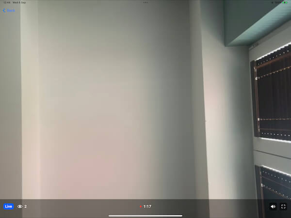

As described in our livestream [tutorial](../../tutorials/livestream/), there are two ways of watching a livestream with StreamVideo's SDK: HLS and WebRTC. 

Watching an HLS livestream can be done using Apple's native [AVPlayer](https://developer.apple.com/documentation/avfoundation/avplayer/).

If you want to watch a WebRTC livestream, then you can either use our `LivestreamPlayer`, or build your own component.

Our `LivestreamPlayer` provides a standard livestreaming experience:
- shows a live indicator
- shows the duration of the livestream
- shows the number of participants
- possibility to enter/leave full screen
- possibility to pause/resume the livestream



### Usage

The `LivestreamPlayer` is a SwiftUI view that can be created with the livestream ID and the call type:

```swift
LivestreamPlayer(type: "livestream", id: "some_id")
```

You can show it, for example, via a `NavigationLink`, or as part of your own custom views.

```swift
NavigationLink {
    LivestreamPlayer(type: "livestream", id: "vQyteZAnDYYk")
} label: {
    Text("Join stream")
}
```

Make sure that the livestream id exists, and the call is not in backstage mode. Otherwise, the player will show a livestream not started error.

### Customization options

Apart from the required parameters, you can also specify some optional ones in the `LivestreamPlayer`'s init method:
- `muted`: `Bool` - whether the livestream audio should be on when joining the stream (default is `true`).
- `showParticipantCount`: `Bool` - whether the participant count should be shown (default is `true`).
- `controlsColor`: `Color` - the color of the controls (default is `white`).
- `onFullScreenStateChange`: `((Bool) -> ())?` - closure that is invoked when the full screen state changes. Useful if you use the livestream component as part of your custom views, since this is the chance to update the visibility of your custom UI elements.