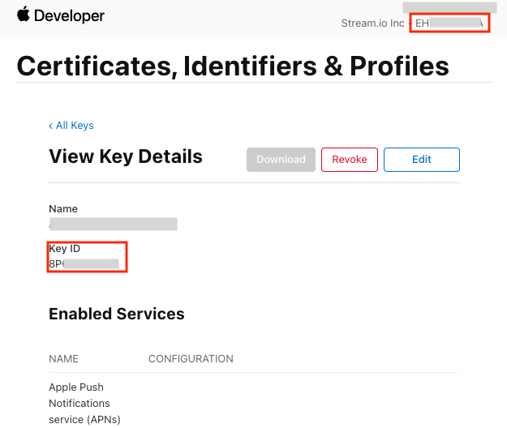
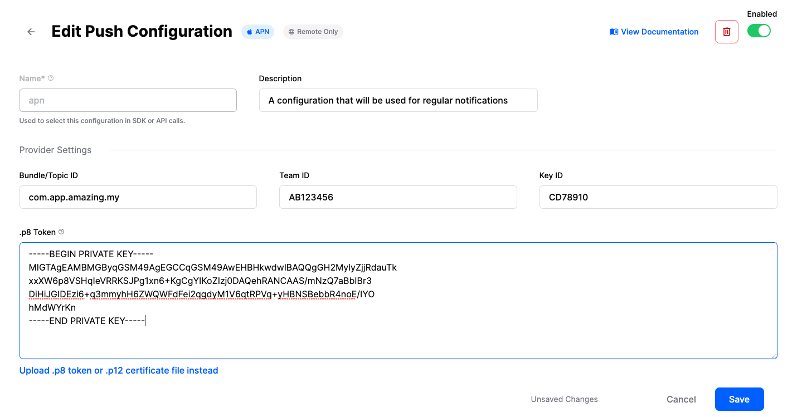

The `StreamVideo` SDK supports two types of push notifications: regular and VoIP notifications. You can use one of them, or both, depending on your use-case.

### StreamVideo setup

The push notification config is provided optionally, when the SDK is initalized. By default, the config uses `apn` as a push provider, for both VoIP and regular push. The push provider name for regular push is "apn", while for VoIP, the name is "voip".

You should have these providers configured on your dashboard. If you don't have them, an error would be thrown when trying to add a device.

You can also change the names or push providers. One restriction is that for VoIP notifications, you have to use `apn` (Firebase doesn't have such support).

Here's an example how to create your own `PushNotificationsConfig`:

```swift
let notificationsConfig = PushNotificationsConfig(
    pushProviderInfo: PushProviderInfo(name: "apn", pushProvider: .apn),
    voipPushProviderInfo: PushProviderInfo(name: "voip", pushProvider: .apn)
)
```

When you initialize the SDK, you should provide the notifications config as a parameter:

```swift
let streamVideo = StreamVideo(
    apiKey: Config.apiKey,
    user: user.userInfo,
    token: user.token,
    videoConfig: VideoConfig(),
    pushNotificationsConfig: notificationsConfig,
    tokenProvider: tokenProvider
)
```

### Push Notifications

Push notifications can be sent for many other different events, such as participants joining, streaming started etc. The setup for push notifications is the standard one - by providing a certificate or APNs key.

#### Dashboard Configuration
In order to configure Push Notifications, you need to visit your app's dashboard. From there, select the `Push Notifications` menu option as you can see in the image below:


From there you can create a new configuration by clicking the `New Configuration` button. After selecting the Push Notification Provider you want, you will be asked to provide the following information:

| Field Name | Usage description |
|---|---|
| `Name` | Used to select this configuration in SDK or API calls. |
| `Description` | Allows you to set a description on the configuration to help identify its usage in your app's context. |
| `Bundle/Topic ID` | Your app's bundle id to which the notification will be pushed to. |
| `TeamID` | The Team ID is generated by Apple for your developer account. Can be found in the top right of your Apple developer account. |
| `KeyID` | This is the unique identifier for the p8 authentication key. You can find your Key ID in the keys section of your [Apple developer](https://developer.apple.com/account/) account. |
| `.p8 Token or .p12 Certificate` | The token or certificate that will be used to send the push notification. |



For our example, we are using `apn` as name and we are filling the remaining information as you can see in the image below:



#### App Configuration

Here's an example setup in the `AppDelegate`:

```swift
class AppDelegate: NSObject, UIApplicationDelegate, UNUserNotificationCenterDelegate {

    func application(
        _ application: UIApplication,
        didFinishLaunchingWithOptions launchOptions: [UIApplication.LaunchOptionsKey: Any]? = nil
    ) -> Bool {
        UNUserNotificationCenter.current().delegate = self
        setupRemoteNotifications()
        return true
    }

    func application(
        _ application: UIApplication,
        didRegisterForRemoteNotificationsWithDeviceToken deviceToken: Data
    ) {
        let deviceToken = deviceToken.map { String(format: "%02x", $0) }.joined()
        AppState.shared.pushToken = deviceToken
    }

    func userNotificationCenter(
        _ center: UNUserNotificationCenter,
        didReceive response: UNNotificationResponse,
        withCompletionHandler completionHandler: @escaping () -> Void
    ) {
        log.debug("push notification received \(response.notification.request.content)")
    }

    func setupRemoteNotifications() {
        UNUserNotificationCenter
            .current()
            .requestAuthorization(options: [.alert, .sound, .badge]) { granted, _ in
                if granted {
                    DispatchQueue.main.async {
                        UIApplication.shared.registerForRemoteNotifications()
                    }
                }
            }
    }
}
```

In the code above, we are first asking for push notification permission, and if granted, we are registering for push notifications.

Whenever we receive a push notification token, we are storing it in our `AppState` (in the demo app). When the `StreamVideo` client is initalized, we are registering the device with our backend, using the `setDevice` method:

```swift
private func setPushToken() {
    if let pushToken, let streamVideo {
        Task {
            try await streamVideo.setDevice(id: pushToken)
        }
    }
}
```

Additionally, consider storing the push notifications tokens locally. You would need to remove them from the Stream backend if the user decides to logout from your app.

With that, the push notifications setup is done and you should be able to receive notifications, if you have proper setup in your Apple developer account, as well as our dashboard.

If you want to customize the content of the push notification, consider implementing a [Notification Service Extension](https://developer.apple.com/documentation/usernotifications/modifying_content_in_newly_delivered_notifications).

#### VoIP Notifications

The VoIP notifications are sent only when a new call is created and the `ring` flag is set to true. You can find more details about the setup in the [CallKit integration guide](./03-callkit-integration.mdx).

When a VoIP notification is sent, a regular push notification is not delivered. VoIP notifications don't work on the iOS simulator, you would need to use a real device.

In order to register a device for VoIP push notifications, you should use the following method:

```swift
try await streamVideo.setVoipDevice(id: voipPushToken)
```

### Removing devices

If you store the device tokens locally, you can remove them at a later stage. For example, the user can explicitly ask for this from your app UI, or you can do this for the user when they decide to logout from your app.

In order to delete a device, you should use the following method from the `StreamVideo` SDK:

```swift
try await streamVideo.deleteDevice(id: savedToken)
```

### Listing devices

If you want to list the devices that are registered to the current user, you should use the `listDevices` method from the `StreamVideo` object:

```swift
let devices = try await streamVideo.listDevices()
```

This method returns an array of the `Device` type, that contains information about the device:

```swift
/** Date/time of creation */
public var createdAt: Date
/** Whether device is disabled or not */
public var disabled: Bool?
/** Reason explaining why device had been disabled */
public var disabledReason: String?
public var id: String
public var pushProvider: String
public var pushProviderName: String?
```
