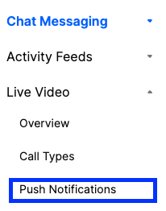
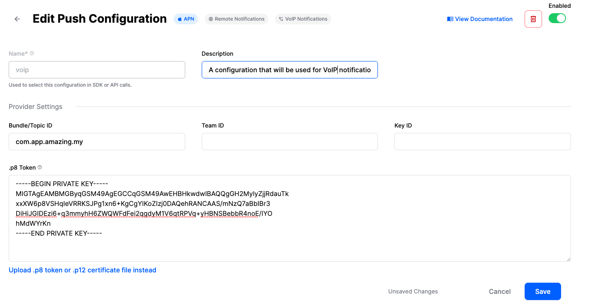

## Introduction

[CallKit](https://developer.apple.com/documentation/callkit) allows us to have system-level phone integration. With that, we can use CallKit to present native incoming call screens, even when the app is closed. CallKit integration also enables the calls made through third-party apps be displayed in the phone's recent call list in the Phone app.

The StreamVideo SDK is compatible with CallKit, enabling a complete calling experience for your users.

## Setup

In order to get started, you would need have a paid Apple developer account, and an app id with push notifications enabled.

In the "Signing & Capabilities" section of your target, make sure that in the "Background Modes" section you have selected:

- "Voice over IP"
- "Remote notifications"
- "Background processing"


Next, you need to create a VoIP calling certificate. In order to do that, go to your Apple developer account, select "Certificates, Identifiers & Profiles" and create a new certificate. Make sure to select `VoIP Services Certificate`, located under the "Services" section. Follow the steps to create the required certificate.


After you've created the certificate, you would need to convert the `aps.cer` file to a .p12 certificate file using keychain access and upload it to our dashboard.

:::note
Make sure that you configure no password for the p12 file.
:::

### Dashboard Configuration

In order to configure VoIP Push Notifications, you need to visit your app's dashboard. From there, select the `Push Notifications` menu option as you can see in the image below:



From there you can create a new configuration by clicking the `New Configuration` button. After selecting the Push Notification Provider you want, you will be asked to provide the following information:

| Field Name | Usage description |
|---|---|
| `Name` | Used to select this configuration in SDK or API calls. |
| `Description` | Allows you to set a description on the configuration to help identify its usage in your app's context. |
| `Bundle/Topic ID` | Your app's bundle id to which the notification will be pushed to. |
| `TeamID` | The Team ID is generated by Apple for your developer account. Can be found in the top right of your Apple developer account. |
| `KeyID` | This is the unique identifier for the p8 authentication key. You can find your Key ID in the keys section of your [Apple developer](https://developer.apple.com/account/) account. |
| `.p8 Token or .p12 Certificate` | The token or certificate that will be used to send the push notification. |

For our example, we are using `voip` as name and we are filling the remaining information as you can see in the image below:



## iOS app integration

From iOS app perspective, there are two Apple frameworks that we need to integrate in order to have a working CallKit integration: `CallKit` and `PushKit`. [PushKit](https://developer.apple.com/documentation/pushkit) is needed for handling VoIP push notifications, which are different than regular push notifications.

We have a working CallKit integration in our demo app. Feel free to reference it for more details, while we will cover the most important bits here.

In order for the CallKit integration to work, you should have a logged in user into your app. For simplicity, we are saving the user in the `UserDefaults`, but we strongly discourage that in production apps, since it's not secure.

### CallKit integration

The StreamVideo SDK provides you with the tools for an easy integration with CallKit. Let' see how:

#### Logging in

Firstly, whenever our user logs in and we instantiate a new StreamVideo object, we need to pass it to the `CallKitAdapter` object like below:
```swift
@Injected(\.callKitAdapter) var callKitAdapter

let streamVideo = StreamVideo(
    apiKey: apiKey,
    user: user,
    token: token,
    tokenProvider: { _ in }
)
callKitAdapter.streamVideo = streamVideo
```

In the next (and final step) we are going to instruct the `CallKitAdapter` to register for VoIP push notifications. We can do that in our SwiftUI `onAppear` block as below:
```swift
struct MyCustomView: View {
    @Injected(\.callKitAdapter) var callKitAdapter

    var body: some View {
        EmptyView() // Your content goes here.
        .onAppear {
            callKitAdapter.registerForIncomingCalls()

            // Here we can also inject an image (e.g. a logo) that will be used
            // by CallKit's UI.
            callKitAdapter.iconTemplateImageData = UIImage(named: "logo")?.pngData()
        }
    }
}
```

or if you are using `UIKit`, you can do the same in your `UIViewController` as below:
```swift
final class MyCustomViewController: UIViewController {
    @Injected(\.callKitAdapter) var callKitAdapter

    override func viewDidLoad() {
        super.viewDidLoad()
        callKitAdapter.registerForIncomingCalls()
        callKitAdapter.iconTemplateImageData = UIImage(named: "logo")?.pngData()
    }
}
```

#### Logging out

In order to unregister the device from receiving VoIP push notifications we need to simply call the `CallKitAdapter` and update its `streamVideo` property with `nil`
```swift
struct MyCustomView: View {
    @Injected(\.streamVideo) var streamVideo
    @Injected(\.callKitAdapter) var callKitAdapter
    @Injected(\.callKitPushNotificationAdapter) var callKitPushNotificationAdapter

    var body: some View {
        Button {
            let deviceToken = callKitPushNotificationAdapter.deviceToken
            if !deviceToken.isEmpty {
                Task {
                    // Unregister the device token
                    try await streamVideo.deleteDevice(id: deviceToken)
                }
            }
            // Perform any other logout operations
            callKitAdapter.streamVideo = nil
        } label: {
            Text("Logout")
        }
    }
}
```

By doing that, the `CallKitAdapter` will make sure to unregister the `VoIP` token from receiving notifications._createMdxContent

#### Call display name

The Stream backend fills 2 properties in the VoIP push notification payload that can be used as the display name of the call.
- **call_display_name**
The `call_display_name` is a calculated property that evaluates the following customData fields on the Call object, in the order they are being presented: 
- `display_name` 
- `name` 
- `title`

```swift
let call = streamVideo.call(callType: "default", callId: UUID().uuidString)
let result = try await call.create(
    memberIds: members, 
    custom: ["display_name": .string("My awesome group")], 
    ring: true
)
```
If none of the fields above are being set, the property will be an empty string.

- **created_by_display_name**
The property is always set and contains the name of the user who created the call.

#### Call Settings when accepting a call

Dependign on your business logic, you may need users to join call with different `CallSettings`(e.g auioOn=true while videoOn=false). In order to achieve that when using the `CallKitAdapter` you can provide your custom `CallSettings` at any point before received a call:

```swift
@Injected(\.callKitAdapter) var callKitAdapter

callKitAdapter.callSettings = CallSettings(audioOn: true, videoOn: false)
```

#### Call's type suffix

Depending on the `Call` type `CallKit` adds a suffix in the push notification's subtitle (which contains the application name). That suffix can either be `Audio` or `Video`. `CallKitService` allows you to configure what the supported call types are, by setting the `CallKitService.supportsVideo` property like below:

```swift
@Injected(\.callKitService) var callKitService

// Setting the `supportsVideo` property to `true` will 
// make the subtitle's format be: `<Application's name> Video`
callKitService.supportsVideo = true 

// Setting the `supportsVideo` property to `false` will 
// make the subtitle's format be: `<Application's name> Audio`
callKitService.supportsVideo = false
```

`CallKitService.supportsVideo` default value is `false`.

### Registering for VoIP Push Notifications

Even though using the `CallKitAdapter` abstracts most of the `CallKit` & `PushKit` complexity from you, there is still a need for you to register/unregister the deviceToken.

You can observe the `voIP` token value by accessing the `deviceToken` property on the `CallKitPushNotificationAdapter`. Whenever the value changes, you should register it with StreamVideo, like below:
```swift
@Injected(\.streamVideo) var streamVideo
@Injected(\.callKitPushNotificationAdapter) var callKitPushNotificationAdapter
var lastVoIPToken: String?
var voIPTokenObservationCancellable: AnyCancellable?

voIPTokenObservationCancellable = callKitPushNotificationAdapter.$deviceToken.sink { [streamVideo] updatedDeviceToken in
    Task {
        if let lastVoIPToken {
            try await streamVideo.deleteDevice(id: lastVoIPToken)
        }
        try await streamVideo.setVoipDevice(id: updatedDeviceToken)
        lastVoIPToken = updatedDeviceToken
    }
}
```

By using the provided `CallKit` integration tools you can start receiving VoIP push notifications in a breeze. 

If you woud like to use your integration, there is no need to worry about `StreamVideo` SDK's integration. The integration is only initialized when you set the `CallKitAdapter.streamVideo` property.

### Starting a call from Recents

When a call is started via `CallKit`, it appears in the "Recents" section in the native iOS phone app. Usually, when you tap on a recents entry, you should be able to call the person again.

For this, we need to add a `INStartCallIntent` intent extension. To do this, go to your targets in Xcode and add a new "Intents Extension".

After the extension is created, go to its `IntentHandler` and add the following code:

```swift
import Intents

class IntentHandler: INExtension, INStartCallIntentHandling {
     override func handler(for intent: INIntent) -> Any {
         return self
     }

     func handle(intent: INStartCallIntent, completion: @escaping (INStartCallIntentResponse) -> Void) {
         let userActivity = NSUserActivity(activityType: NSStringFromClass(INStartCallIntent.self))
         let response = INStartCallIntentResponse(code: .continueInApp, userActivity: userActivity)

         completion(response)
     }
}
```

In the `Info.plist` file of the extension, add the `INStartCallIntent` value in `IntentsSupported`, under `NSExtension` -> `NSExtensionAttributes`.

With this setup, our app has the ability to react to `INStartCallIntent`s. Next, let's handle these intents in our SwiftUI code.

In the `CallView` in our DemoApp, we are adding the following code:

```swift
var body: some View {
    HomeView(viewModel: viewModel)
        .modifier(CallModifier(viewModel: viewModel))
        .onContinueUserActivity(
            NSStringFromClass(INStartCallIntent.self),
            perform: {
                userActivity in
                let interaction = userActivity.interaction
                if let callIntent = interaction?.intent as? INStartCallIntent {

                    let contact = callIntent.contacts?.first

                    guard let name = contact?.personHandle?.value else { return }
                    viewModel.startCall(
                        callType: .default,
                        callId: UUID().uuidString,
                        members: [.init(userId: name)],
                        ring: true
                    )
                }
            }
        )
}
```

The important part is the `onContinueUserActivity`, where we listen to `INStartCallIntent`s. In the closure, we are extracting the first contact and take their name, which is the user id. We use that name to start a ringing call.

Additionally, if you have integration with the native contacts on iOS (`Contacts` framework), you can extract the full name, phone number etc, and use those to provide more details for the members. Alternatively, you can call our `queryUsers` method to get more user information that's available on the Stream backend.

If you are using UIKit, you should implement the method `application(_ application: UIApplication, continue userActivity: NSUserActivity, restorationHandler: @escaping ([UIUserActivityRestoring]?) -> Void)` in your `AppDelegate`, and provide a similar handling as in the SwiftUI sample.
