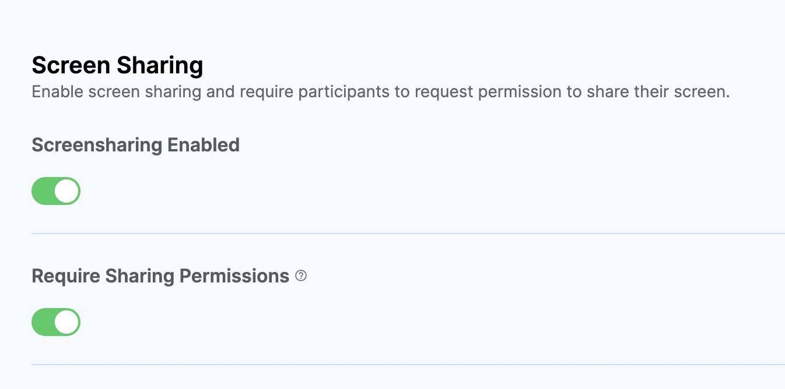
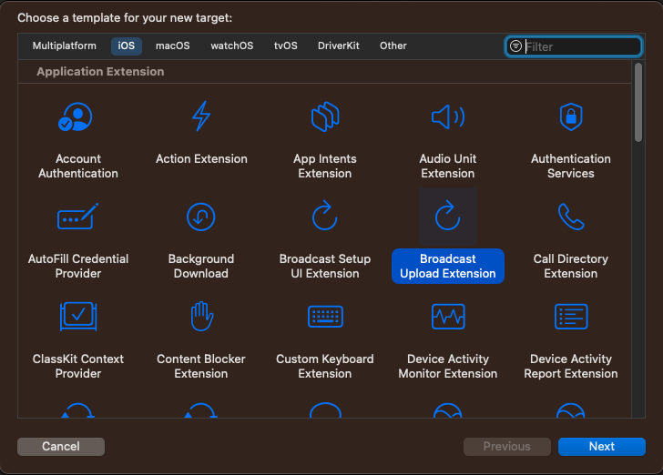

## Introduction

The StreamVideo iOS SDK has support for displaying screensharing tracks, as well as screensharing from an iOS device. There are two options for screensharing from an iOS device:
- in-app screensharing - the screen is shared only while the app is active.
- broadcasting - the device shares the screen even when the app goes into the background.

Both of these options use Apple's framework `ReplayKit` for broadcasting the user's screen. 

In order for a user to be able to share their screen, they must have the `screenshare` capability configured for the call they are in.

This can be configured on the dashboard for your call type:



## In-app screensharing

In-app screensharing broadcasts only the app's screens. When you are in a call, and you have the required capability, you can start screensharing by calling the `startScreensharing` method, with the `inApp` screensharing type:

```swift
Task {
    let call = streamVideo.call(callType: "default", callId: "123")
    try await call.join()
    try await call.startScreensharing(type: .inApp)
}
```  

If you use our UI components and the `CallViewModel`, the same method is also available from there.

When the method is invoked, `ReplayKit` will ask for the user's consent that their screen will be shared. Only after the permission is granted, the screensharing starts.

If you want to stop screensharing, you need to call the method `stopScreensharing`, available from both the `Call` object and the `CallViewModel`:

```swift
Task {
    try await call.stopScreensharing()
}
```

When the current user shares their screen, the `screenshareTrack` property can be used to present the track into a video rendering view. For example, you can use our `VideoRendererView`:

```swift
VideoRendererView(
    id: "\(participant.id)-screenshare",
    size: videoSize,
    contentMode: .scaleAspectFit
) { view in
    if let track = participant.screenshareTrack {
        log.debug("adding screensharing track to a view \(view)")
        view.add(track: track)
    }
}
```

If you use our default UI components, this logic is already handled for you. In that case, you can customize the look and feel of the screensharing view, by implementing the `makeScreensharingView` in our `ViewFactory`:

```swift
public func makeScreenSharingView(
        viewModel: CallViewModel,
        screensharingSession: ScreenSharingSession,
        availableFrame: CGRect
) -> some View {
    CustomScreenSharingView(
        viewModel: viewModel,
        screenSharing: screensharingSession,
        availableFrame: availableFrame
    )
}
```

We also have a component called `ScreenshareIconView` that you can integrate into your video controls, to directly start screensharing:

```swift
ScreenshareIconView(viewModel: viewModel)            
```

## Broadcasting

In most cases, you would need to share your screen while you are in the background, to be able to open other apps. For this, you need to create a Broadcast Upload Extension:



After you create the extension, there should be a class called `SampleHandler`, that implements the `RPBroadcastSampleHandler` protocol. Remove the protocol conformance and the methods, import our `StreamVideo` SDK, and make the `SampleHandler` a subclass of our class called `BroadcastSampleHandler`, that internally handles the broadcasting.

The resulting file should look like this:

```swift
import ReplayKit
import StreamVideo

class SampleHandler: BroadcastSampleHandler {}
```

Next, you should create an app group for your app id. You can find more details on how to create app groups on Apple's developer [website](https://developer.apple.com/documentation/xcode/configuring-app-groups#Create-App-Groups-for-all-other-platforms). Make sure that both the app and its extension have the same app group id configured, since that one will be used for passing data between them.

Finally, you should add a new entry in the `Info.plist` files in both the app and the broadcast extension, with a key `BroadcastAppGroupIdentifier` and a value of the app group id.

With that, the setup for the broadcast upload extension is done.

### Starting screensharing

After you have done the setup above, you can start screensharing. For this, you would need to use Apple's [RPSystemBroadcastPickerView](https://developer.apple.com/documentation/replaykit/rpsystembroadcastpickerview), which presents a system UI for starting the screensharing. 

For easier integration, we offer a `BroadcastIconView`, which is a already setup component that triggers the system UI, listens to events when interacting with it, and starts the screensharing accordingly.

```swift
BroadcastIconView(
    viewModel: viewModel,
    preferredExtension: "bundle_id_of_broadcast_upload_extension"
)
```

The `preferredExtension` parameter should match the bundle id of the broadcast upload extension you created above.

If you want to implement your own UI component for broadcasting, you can use our building blocks, `BroadcastPickerView` (a SwiftUI wrapper for `RPSystemBroadcastPickerView`) and the `BroadcastObserver` observable object, which provides information about the `BroadcastState`, with the following values:

```swift
public enum BroadcastState {
    case notStarted
    case started
    case finished
}
```

Here's an example implementation:

```swift
public struct BroadcastIconView: View {
        
    var call: Call
    @StateObject var broadcastObserver = BroadcastObserver()
    let size: CGFloat
    let preferredExtension: String
    
    public init(
        call: Call,
        preferredExtension: String,
        size: CGFloat = 50
    ) {
        self.call = call
        self.preferredExtension = preferredExtension
        self.size = size
    }
    
    public var body: some View {
        BroadcastPickerView(
            preferredExtension: preferredExtension
        )
        .onChange(of: broadcastObserver.broadcastState, perform: { newValue in
            if newValue == .started {
                startScreensharing()
            } else if newValue == .finished {
                stopScreensharing()
            }
        })
        .onAppear {
            broadcastObserver.observe()
        }
    }

    private func startScreensharing() {
        Task {
            try await call.startScreensharing(type: .broadcast)
        }
    }

    private func stopScreensharing() {
        Task {
            try await call.stopScreensharing()
        }
    }
}
```
