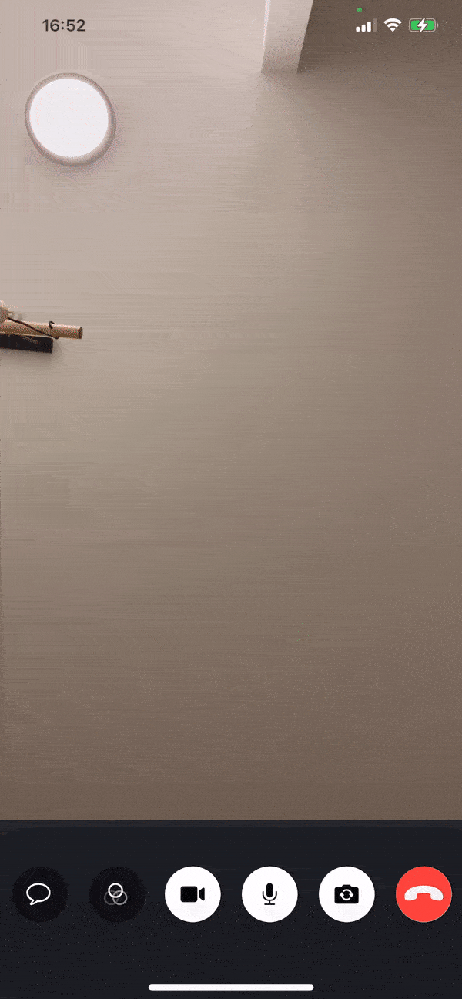

## Introduction

It's common for calling apps to have chat, as well as the opposite - chat apps to have a calling functionality. Stream's Chat and Video SDKs are perfectly compatible between each other, and can easily be integrated into an app.

:::tip
You can find an example chat integration with our video product, in our samples [repo](https://github.com/GetStream/stream-video-ios-examples/tree/main/VideoWithChat/VideoWithChat).
:::

## Adding chat into video

In this guide you will take a video-based application and add chat functionality with the Stream Chat SDK on top of it. Here is an example of what the end result will look like:



:::info
The starting point for this guide is a functioning video calling application. If you don't have one and want to follow along, feel free to do our [step-by-step tutorial](https://getstream.io/video/docs/ios/tutorials/video-calling/) first.
:::

### Connecting the Video and Chat Client

You should have a setup for both the video and chat client. They both require the same API key, as well as the same user token.

The sample repo contains a simple [`StreamWrapper`](https://github.com/GetStream/stream-video-ios-examples/blob/main/VideoWithChat/VideoWithChat/StreamWrapper.swift), that can help you initialize and connect both clients.

Here's an example on how to initialize the `StreamWrapper`:

```swift
let streamWrapper = StreamWrapper(
    apiKey: "YOUR_API_KEY",
    userCredentials: user,
    tokenProvider: { result in
        let token = \\ Fetch the token from your backend
        result(.success(token))
    }
)
```

Note that you can also setup the clients in a different way, without using this wrapper. More information on how to setup the Stream Chat SwiftUI SDK can be found [here](https://getstream.io/chat/docs/sdk/ios/swiftui/getting-started/).

## Adding Chat to the Call Controls

The simplest way to add chat to an existing video calling app is to extend the call controls with an additional chat icon. To do this, implement the `makeCallControlsView` in your custom implementation of the `ViewFactory` from the Stream Video SDK (in our case it's called `VideoWithChatViewFactory`, see [here](https://github.com/GetStream/stream-video-ios-examples/blob/main/VideoWithChat/VideoWithChat/Sources/VideoWithChatViewFactory.swift)):

```swift
class VideoWithChatViewFactory: ViewFactory {

    /* ... Previous code skipped. */

    // highlight-start
    func makeCallControlsView(viewModel: CallViewModel) -> some View {
        ChatCallControls(viewModel: viewModel)
    }
    // highlight-end
}

```

Create a new SwiftUI view called `ChatCallControls` and add the code for the `ToggleChatButton` to the file (for example at the bottom):

```swift
struct ToggleChatButton: View {

    @ObservedObject var chatHelper: ChatHelper

    var body: some View {
        Button {
            // highlight-next-line
            // 1. Toggle chat window
            withAnimation {
                chatHelper.chatShown.toggle()
            }
        }
        label: {
            // highlight-next-line
            // 2. Show button
            CallIconView(
                icon: Image(systemName: "message"),
                size: 50,
                iconStyle: chatHelper.chatShown ? .primary : .transparent
            )
            // highlight-next-line
            // 3. Overlay unread indicator
            .overlay(
                chatHelper.unreadCount > 0 ?
                TopRightView(content: {
                    UnreadIndicatorView(unreadCount: chatHelper.unreadCount)
                })
                : nil
            )
        }
    }
}
```

The code does three interesting things (see the numbered comments):

1. On tapping the button it toggles the chat window
2. Showing a button that indicates that there is a chat to open
3. It overlays an unread indicator when there's new chat messages

Here's the (simplified, [see full version](https://github.com/GetStream/stream-video-ios-examples/blob/main/VideoWithChat/VideoWithChat/Sources/ChatCallControls.swift)) implementation of the `ChatCallControls` itself, that handles the display of the chat inside it.

```swift
struct ChatCallControls: View {

    @ObservedObject var viewModel: CallViewModel

    @StateObject private var chatHelper = ChatHelper()

    public var body: some View {
        // highlight-next-line
        // 1. Arrange code in VStack
        VStack {
            HStack {
                ToggleChatButton(chatHelper: chatHelper)

                // Unrelated code skipped. Check repository for complete code:
                // https://github.com/GetStream/stream-video-ios-examples/blob/main/VideoWithChat/VideoWithChat/Sources/ChatCallControls.swift
            }

            // highlight-next-line
            // 2. If chat is activated, show the ChatChannelView
            if chatHelper.chatShown {
                if let channelController = chatHelper.channelController {
                    ChatChannelView(
                        viewFactory: ChatViewFactory.shared,
                        channelController: channelController
                    )
                        .frame(height: UIScreen.main.bounds.height / 3 + 50)
                        .onAppear {
                            chatHelper.markAsRead()
                        }
                } else {
                    Text("Chat not available")
                }
            }
        }
        .frame(maxWidth: .infinity)
        .frame(height: chatHelper.chatShown ? (UIScreen.main.bounds.height / 3 + 50) + 100 : 100)
        /* more modifiers */
        // highlight-next-line
        // 3. Listen to changes in call participants and update the UI accordingly
        .onReceive(viewModel.$callParticipants, perform: { output in
            if viewModel.callParticipants.count > 1 {
                chatHelper.update(memberIds: Set(viewModel.callParticipants.map(\.key)))
            }
        })
    }
}
```

The lines that are marked do the following:

1. The entire code is wrapped in a `VStack` to show content vertically, with chat being slid in from the bottom, once shown. The buttons on the other hand are wrapped in a `HStack`.
2. If `chatHelper.chatShown` is true and a `channelController` can be retrieved, the `ChatChannelView` from the Stream Chat SDK is used to display chat.
3. Subscribing to changes in the `callParticipants` allows to make sure the UI is always up-to-date.

Note that both the Video and Chat SDK should be setup with the same API key and token, before displaying this view.

:::tip
Not sure how to do this? Start [here for video](https://getstream.io/video/docs/ios/guides/client-auth/) and [here for chat](https://getstream.io/chat/docs/sdk/ios/swiftui/getting-started/#creating-the-swiftui-context-provider-object).
:::

That's everything that's needed to add a button in the call controls, that will show a chat during the call.

### Conclusion

In this article, we have seen how the two SDKs for chat and video can work together. 

For more examples on how to create enganging video experiences, please check our video [cookbook](https://getstream.io/video/docs/ios/ui-cookbook/overview/) and [UI components](https://getstream.io/video/docs/ios/ui-components/overview/).

You can find more details about our chat SDK in the [chat docs](https://getstream.io/chat/docs/sdk/ios/swiftui/).