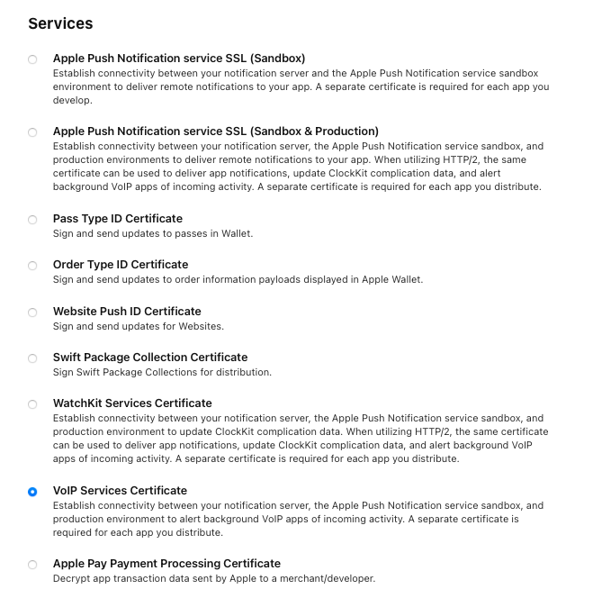

## Introduction

[CallKit](https://developer.apple.com/documentation/callkit) allows us to have system-level phone integration. With that, we can use CallKit to present native incoming call screens, even when the app is closed. CallKit integration also enables the calls made through third-party apps be displayed in the phone's recent call list in the Phone app.

The StreamVideo SDK is compatible with CallKit, enabling a complete calling experience for your users.

## Setup

In order to get started, you would need have a paid Apple developer account, and an app id with push notifications enabled.

In the "Signing & Capabilities" section of your target, make sure that in the "Background Modes" section you have selected:

- "Voice over IP"
- "Remote notifications"
- "Background processing"


Next, you need to create a VOIP calling certificate. In order to do that, go to your Apple developer account, select "Certificates, Identifiers & Profiles" and create a new certificate. Make sure to select `"VoIP Services Certificate"`, located under the "Services" section. Follow the steps to create the required certificate.



After you've created the certificate, you would need to upload it to our dashboard.

//TODO: we need to implement this feature in the dashboard.

## iOS app integration

From iOS app perspective, there are two Apple frameworks that we need to integrate in order to have a working CallKit integration: `CallKit` and `PushKit`. [PushKit](https://developer.apple.com/documentation/pushkit) is needed for handling VoIP push notifications, which are different than regular push notifications.

We have a working CallKit integration in our demo app. Feel free to reference it for more details, while we will cover the most important bits here.

In order for the CallKit integration to work, you should have a logged in user into your app. For simplicity, we are saving the user in the `UserDefaults`, but we strongly discourage that in production apps, since it's not secure.

### PushKit integration

For handling VoIP push notifications, we will create a new class, called `VoipPushService`, that implements the `PKPushRegistryDelegate`. Internally, we will create an instance of `PKPushRegistry`, which requests the delivery and handles the receipt of PushKit notifications.

```swift
class VoipPushService: NSObject, PKPushRegistryDelegate {

    @Injected(\.streamVideo) var streamVideo

    private let voipQueue: DispatchQueue
    private let voipRegistry: PKPushRegistry
    private let voipTokenHandler: VoipTokenHandler
    private lazy var voipNotificationsController = streamVideo.makeVoipNotificationsController()

    var onReceiveIncomingPush: VoipPushHandler

    init(voipTokenHandler: VoipTokenHandler, pushHandler: @escaping VoipPushHandler) {
        self.voipTokenHandler = voipTokenHandler
        self.voipQueue = DispatchQueue(label: "io.getstream.voip")
        self.voipRegistry = PKPushRegistry(queue: voipQueue)
        self.onReceiveIncomingPush = pushHandler
    }
}
```

When the app is started, we need to register for VoIP push notifications, by adding the following method to the `VoipPushService`:

```swift
func registerForVoIPPushes() {
    self.voipRegistry.delegate = self
    self.voipRegistry.desiredPushTypes = [.voIP]
}
```

You should call this method after the user authenticates in your app.

Next, we need to implement the `PKPushRegistryDelegate`:

```swift
func pushRegistry(_ registry: PKPushRegistry, didUpdate credentials: PKPushCredentials, for type: PKPushType) {
    let deviceToken = credentials.token.map { String(format: "%02x", $0) }.joined()
    log.debug("pushRegistry deviceToken = \(deviceToken)")
    voipNotificationsController.addDevice(with: deviceToken)
    voipTokenHandler.save(voipPushToken: deviceToken)
}

func pushRegistry(_ registry: PKPushRegistry, didInvalidatePushTokenFor type: PKPushType) {
    log.debug("pushRegistry:didInvalidatePushTokenForType:")
    if let savedToken = voipTokenHandler.currentVoipPushToken() {
        voipNotificationsController.removeDevice(with: savedToken)
        voipTokenHandler.save(voipPushToken: nil)
    }
}

func pushRegistry(
    _ registry: PKPushRegistry,
    didReceiveIncomingPushWith payload: PKPushPayload,
    for type: PKPushType,
    completion: @escaping () -> Void
) {
    self.onReceiveIncomingPush((payload, type, completion))
}
```

#### Saving the PN credentials

We're implementing three methods here. The `pushRegistry(_ registry: PKPushRegistry, didUpdate credentials: PKPushCredentials, for type: PKPushType)` method is called when new push notifications credentials are provided. You should use this method to save the device token to our backend, by using `VoipNotificationsController`'s method `addDevice`. Also, you should save the token locally, in order to be able to delete it from the backend if the user logs out. For simplicity, we're storing it in a simple `UserDefaults` wrapper, but in a real-world app you should store it in a more secure place, such as the iOS Keychain.

#### Removing the PN credentials

The `pushRegistry(_ registry: PKPushRegistry, didInvalidatePushTokenFor type: PKPushType)` is called when the push token is invalidated. When this method is called, you should delete the value saved with the method above.

#### Receiving a push notification

The method `pushRegistry(_ registry: PKPushRegistry, didReceiveIncomingPushWith payload: PKPushPayload, for type: PKPushType, completion: @escaping () -> Void)` is called whenever a VoIP push notification is received. We're just passing this information to another object, called `CallService` (more on that shortly), by calling the `onReceiveIncomingPush` closure.

### CallKit integration

The `CallService` class handles the `onReceiveIncomingPush` callbacks invoked by the `VoipPushService`. Whenever the handler is called, the `CallService` uses another class, called `CallKitService`, that handles the `CallKit` integration.

```swift
class CallService {

    private static let defaultCallText = "You are receiving a call"

    static let shared = CallService()

    let callService = CallKitService()

    lazy var voipPushService = VoipPushService(
        voipTokenHandler: UnsecureUserRepository.shared
    ) { [weak self] payload, type, completion in
        let aps = payload.dictionaryPayload["aps"] as? [String: Any]
        let alert = aps?["alert"] as? [String: Any]
        let callCid = alert?["call_cid"] as? String ?? "unknown"
        self?.callService.reportIncomingCall(
            callCid: callCid,
            callInfo: self?.callInfo(from: alert) ?? Self.defaultCallText
        ) { _ in
            completion()
        }
    }

    func registerForIncomingCalls() {
        voipPushService.registerForVoIPPushes()
    }

    private func callInfo(from callPayload: [String: Any]?) -> String {
        guard let userIds = callPayload?["user_ids"] as? String else { return Self.defaultCallText }
        let parts = userIds.components(separatedBy: ",")
        if parts.count == 0 {
            return Self.defaultCallText
        } else if parts.count == 1 {
            return "\(parts[0]) is calling you"
        } else if parts.count == 2 {
            return "\(parts[0]) and \(parts[1]) are calling you"
        } else {
            let othersCount = parts.count - 2
            return "\(parts[0]), \(parts[1]) and \(othersCount) are calling you"
        }
    }
}
```

The `CallKitService` has a method called `reportIncomingCall`, which reports the call to the OS:

```swift
func reportIncomingCall(
    callCid: String,
    callInfo: String,
    completion: @escaping (Error?) -> Void
) {
    let configuration = CXProviderConfiguration()
    configuration.supportsVideo = true
    configuration.supportedHandleTypes = [.generic]
    let provider = CXProvider(
        configuration: configuration
    )
    provider.setDelegate(self, queue: nil)
    let update = CXCallUpdate()
    let idComponents = callCid.components(separatedBy: ":")
    if idComponents.count >= 2  {
        self.callId = idComponents[1]
        self.callType = idComponents[0]
    }
    let callUUID = UUID()
    callKitId = callUUID
    update.remoteHandle = CXHandle(type: .generic, value: callInfo)
    provider.reportNewIncomingCall(
        with: callUUID,
        update: update,
        completion: completion
    )
}
```

The method also saves the `callId` and `callType`, and it generates a call UUID, which is required by CallKit for identifying calls.

The call can happen completely inside the native calling screen, or be transferred to the app. With the latter scenario, the SDKs calling view is presented. Important aspect with this case is syncing the actions performed from the in-app call view with the `CallKit` actions.

First, we need to accept the call both from `CallKit`, as well as initiate the call inside the SDK. This is done with the `provider(_ provider: CXProvider, perform action: CXAnswerCallAction)` method in the `CXProviderDelegate`.

```swift
func provider(_ provider: CXProvider, perform action: CXAnswerCallAction) {
    guard let currentUser = UnsecureUserRepository.shared.loadCurrentUser() else {
        action.fail()
        return
    }
    if !callId.isEmpty {
        if AppState.shared.streamVideo == nil {
            let streamVideo = StreamVideo(
                apiKey: "key1",
                user: currentUser.userInfo,
                token: currentUser.token,
                videoConfig: VideoConfig(
                    persitingSocketConnection: true,
                    joinVideoCallInstantly: false
                ),
                tokenProvider: { result in
                    result(.success(currentUser.token))
                }
            )
            AppState.shared.streamVideo = streamVideo
        }
        let callType: CallType = .init(name: callType)
        let callController = streamVideo.makeCallController(callType: callType, callId: callId)
        Task {
            _ = try await callController.joinCall(
                callType: callType,
                callId: callId,
                callSettings: CallSettings(),
                videoOptions: VideoOptions(),
                participantIds: []
            )
            await MainActor.run {
                AppState.shared.activeCallController = callController
                action.fulfill()
            }
        }
    }
}
```

We're also listening to `CallNotification.callEnded` notification, published from the StreamVideo SDK. This notification is sent whenever the user ends the call from the in-app view.

```swift
@objc func endCurrentCall() {
    guard let callKitId = callKitId else { return }
    let endCallAction = CXEndCallAction(call: callKitId)
    let transaction = CXTransaction(action: endCallAction)
    requestTransaction(transaction)
    self.callKitId = nil
}
```

Similarly, when the user decides to end the call via the `CallKit` interface, we need to cleanup the session in the StreamVideo SDK.

```swift
func provider(_ provider: CXProvider, perform action: CXEndCallAction) {
    callKitId = nil
    streamVideo.leaveCall()
    action.fulfill()
}
```
